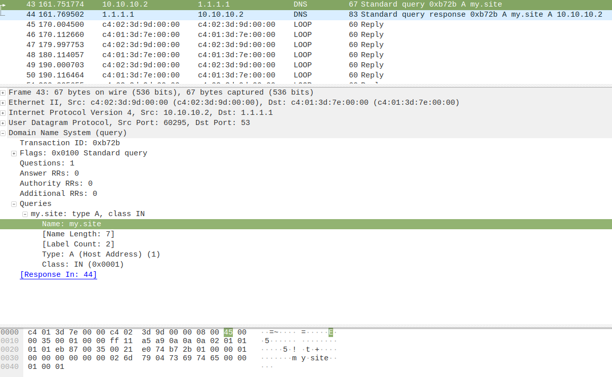
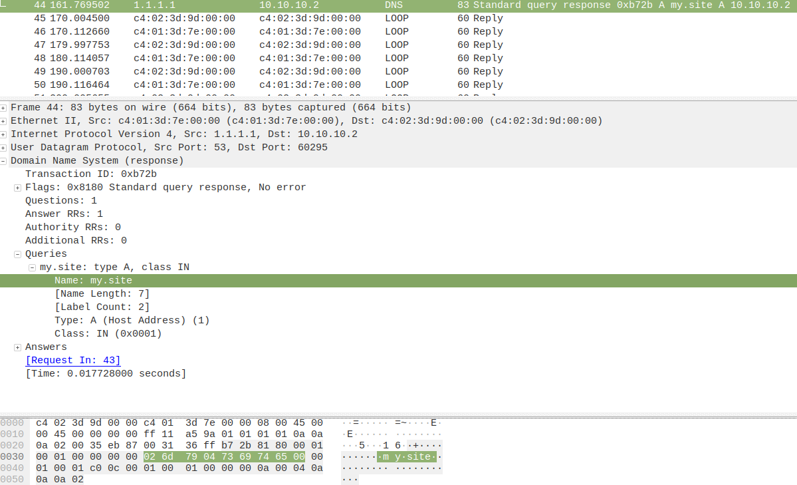

Dns запрос:
  

DNS ответ

# Аналитический разбор DNS-инфраструктуры и пакетов 
## 1. Анатомия полей DNS-пакета и кодирование меток При анализе дампа `dns.pcap` зафиксирована следующая структура заголовков прикладного уровня:

- **Transaction ID**: 16-битный идентификатор (`0x3a4b`), служащий для сопоставления асинхронных UDP-запросов и ответов на стороне клиента. 

- **Flags**: Поле состояния. В запросе клиента используется значение `0x0100` (стандартный запрос с требованием рекурсии).

 - **Questions**: Количество запрашиваемых FQDN-имен в секции Queries (равно 1). 

 - **Answers**: Количество возвращаемых ресурсных записей в секции Answers (0 в запросе, >=1 в легитимном ответе). 

### Кодирование доменного имени (Формат меток): В бинарном теле пакета точки отсутствуют. Имя `my.site` разбивается на две метки, перед каждой из которых указывается 1 байт длины: 1. Метка `my` (длина 2) -> `02` + ASCII символы `6d 79` 2. Метка `site` (длина 4) -> `04` + ASCII символы `73 69 74 65` 3. Маркер завершения строки -> Нулевой байт `00` *Итоговое представление в HEX-дампе:* `02 6d 79 04 73 69 74 65 00` 

cd ~/Документы/CbS/CbS1_Networking_basics_Part_1-1/src
mkdir -p ai-logs

cat << 'EOF' > ai-logs/dns.md
# Аналитический разбор DNS-инфраструктуры и пакетов

## 1. Анатомия полей DNS-пакета и кодирование меток
При анализе дампа `dns.pcap` зафиксирована следующая структура заголовков прикладного уровня:
- **Transaction ID**: 16-битный идентификатор (`0x3a4b`), служащий для сопоставления асинхронных UDP-запросов и ответов на стороне клиента.
- **Flags**: Поле состояния. В запросе клиента используется значение `0x0100` (стандартный запрос с требованием рекурсии).
- **Questions**: Количество запрашиваемых FQDN-имен в секции Queries (равно 1).
- **Answers**: Количество возвращаемых ресурсных записей в секции Answers (0 в запросе, >=1 в легитимном ответе).

### Кодирование доменного имени (Формат меток):
В бинарном теле пакета точки отсутствуют. Имя `my.site` разбивается на две метки, перед каждой из которых указывается 1 байт длины:
1. Метка `my` (длина 2) -> `02` + ASCII символы `6d 79`
2. Метка `site` (длина 4) -> `04` + ASCII символы `73 69 74 65`
3. Маркер завершения строки -> Нулевой байт `00`
*Итоговое представление в HEX-дампе:* `02 6d 79 04 73 69 74 65 00`

---

## 2. Иерархия DNS: Схема рекурсивного запроса для www.google.com
Если изолированный резолвер получает запрос на домен вне его зоны ответственности (`www.google.com`), классический итерационный путь выглядит так:
1. **Клиент -> Локальный резолвер**: "Какой IP у www.google.com?"
2. **Локальный резолвер -> Root DNS (.)**: "Где найти www.google.com?" -> Ответ: "Не знаю, но вот IP серверов зоны .com".
3. **Локальный резолвер -> TLD DNS (.com)**: "Где найти www.google.com?" -> Ответ: "Не знаю, но вот авторитативные NS-сервера google.com".
4. **Локальный резолвер -> Авторитативный DNS (google.com)**: "Какой IP у www.google.com?" -> Ответ: "IP-адрес хоста: 172.217.16.14".
5. **Локальный резолвер -> Клиент**: Возврат искомого IPv4-адреса типа A.

---

## 3. Альтернативные типы ресурсных записей
1. **MX (Mail Exchanger)**: Маршрутизация корпоративной почты.
   - *Ответ сервера:* `domain.local MX preference = 10, mail exchanger = mail.domain.local`
2. **CNAME (Canonical Name)**: Создание псевдонимов для хостов (алиасинг).
   - *Ответ сервера:* `www.domain.local CNAME target = domain.local`
3. **TXT (Text record)**: Внедрение машиночитаемых текстовых данных (политики безопасности SPF/DKIM/DMARC).
   - *Ответ сервера:* `domain.local TXT "v=spf1 mx ip4:10.10.10.1 -all"`
