# Операционные системы UNIX/Linux (Базовый) 

[Установка ОС](#part-1-установка-ос)  
[Создание пользователя ](#part-2-создание-пользователя)  
[Настройка сети ОС](#part-3-настройка-сети-ос)  
[Обновление ОС](#part-4-обновление-ос)  
[Использование команды sudo](#part-5-использование-команды-sudo)  
[Установка и настройка службы времени](#part-6-установка-и-настройка-службы-времени)  
[Установка и использование текстовых редакторов](#part-7-установка-и-использование-текстовых-редакторов)  
[Установка и базовая настройка сервиса SSHD](#part-8-установка-и-базовая-настройка-сервиса-sshd)  
[Установка и использование утилит top, htop](#part-9-установка-и-использование-утилит-top-htop)   
[Использование утилиты fdisk](#part-10-использование-утилиты-fdisk)  
[Использование утилиты df](#part-11-использование-утилиты-df)  
[Использование утилиты du](#part-12-использование-утилиты-du)  
[Установка и использование утилиты ncdu](#part-13-установка-и-использование-утилиты-ncdu)
[Работа с системными журналами](#part-14-работа-с-системными-журналами)  
[Использование планировщика заданий **CRON**](#part-15-использование-планировщика-заданий-cron)

## Part 1. Установка ОС

  * Графический интерфейс должен отсутствовать.  
    Запускаем графический интерфейс:  
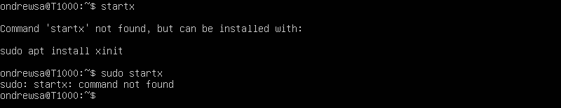  
    Он отсутствует.  

  * Узнаем текущую версию Ubuntu  
  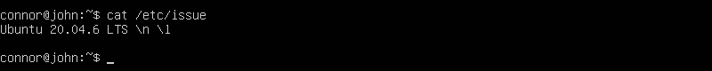  

## Part 2. Создание пользователя  

  * Чтобы создать нового пользователя, используется команда: useradd, с флагами -G (с добавлением в группу adm) и -m для создания домашнего каталога пользователя  
  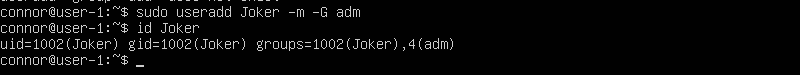  
    

## Part 3. Настройка сети ОС  

  * Узнаем имя компьютера  
  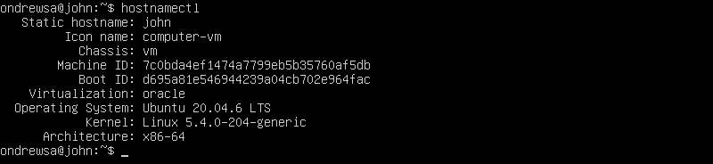  
   Меняем имя компьютера sudo vim /etc/hostname  
    
    
  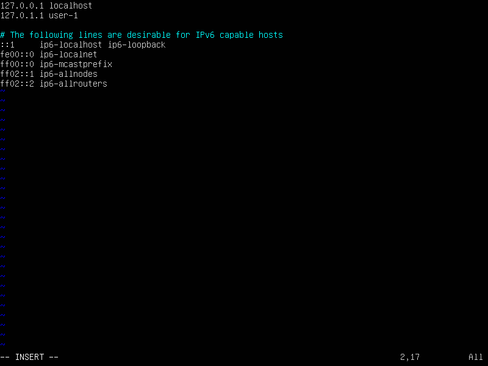  
  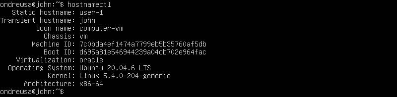  

  * Установить временную зону в соответствии с моим расположением:  
   узнаем текущую временную зону: timedatectl;  
   выводим список доступных временных зон: timedatectl list-timezones;  
   устанвливаем нужную временную зону: timedatectl  set-timezone Europe/Moscow.  
   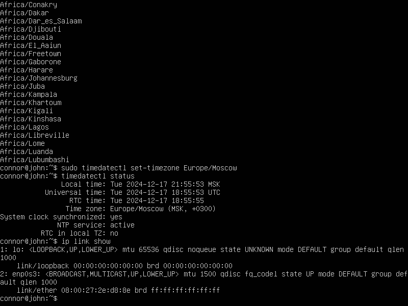  

  * Вывести название сетевых интерфейсов с помощью консольной команды ip link show  
  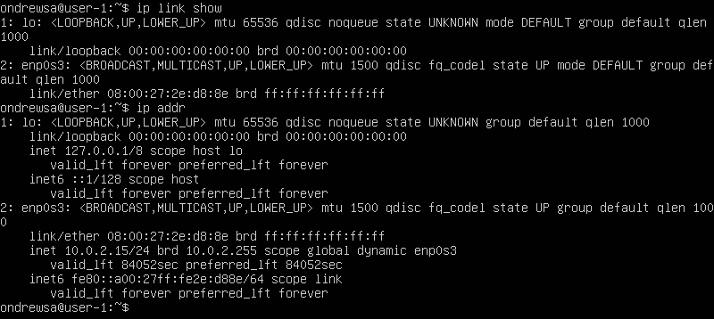  
  Интерфейс lo - это интерфейс для передачи данных между программами на одном и том же компьютере. Предназначен для тестирования сетевых служб без реальной работы с сетью.  
  * Используя консольную команду получить ip адрес устройства, на котором вы работаете, от DHCP сервера.  
    

  DHCP (Dynamic Host Configuration Protocol) — это сетевой протокол, который позволяет компьютерам и другим устройствам автоматически получать IP-адрес и другую необходимую информацию для подключения к сети.  
  * Определи и выведи на экран внешний ip-адрес шлюза (ip) и внутренний IP-адрес шлюза.  
  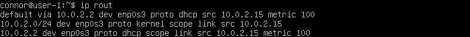  
  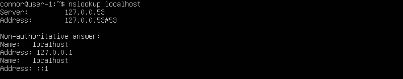  
  * Задай статичные настройки ip, gw, dns.  
  Редактируем файл /etc/netplan/00-install-config.yaml  
  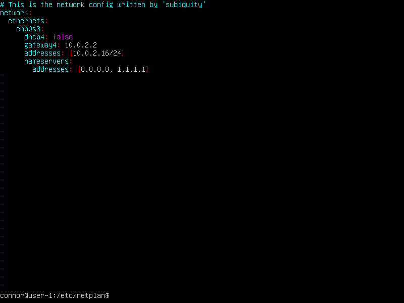  
  Применяем и проверяем настройки  
  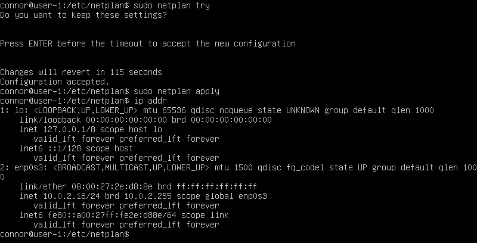  
systemd-resolve --status  
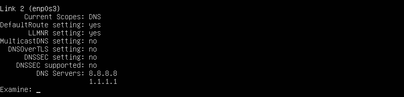  
* пингуем 1.1.1.1 и ya.ru  
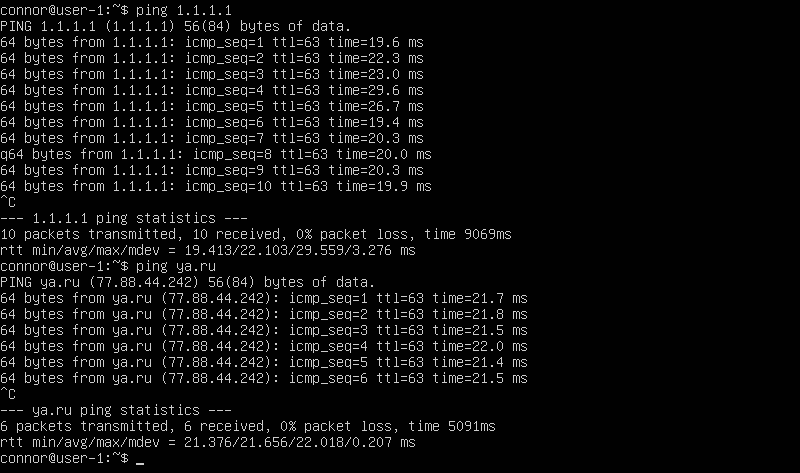  
  
  ## Part 4. Обновление ОС  

  Обновляем ОС: sudo apt-get upgrade  
  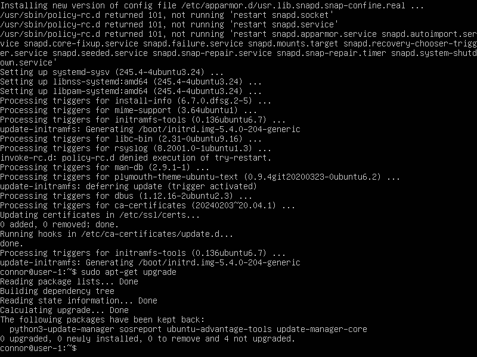  

  ## Part 5. Использование команды sudo  

Команда sudo (от англ. superuser do) в операционных системах Unix-подобных (таких как Linux, macOS и BSD) позволяет пользователям выполнять команды с привилегиями суперпользователя (root). Это позволяет обычным пользователям выполнять административные задачи без постоянного входа в систему с учетной записью root.  
Добавляем пользователя ondrewsa в группу sudo и проверяем что он в ней состоит.  
  
Узнаем и меняем имя машины:  
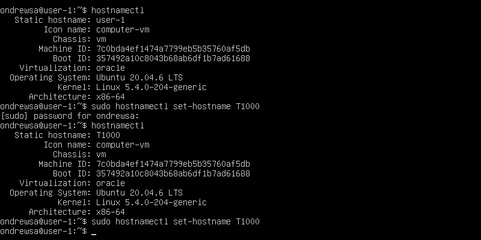  
Проверяем имя:  
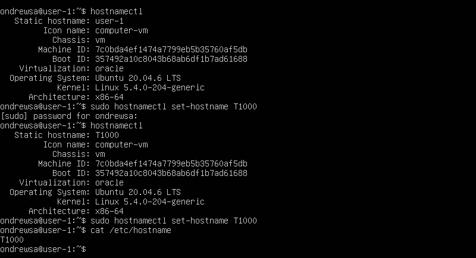  

## Part 6. Установка и настройка службы времени  
Устанавливаем протокол синхронизации времени sudo apt install ntp.  
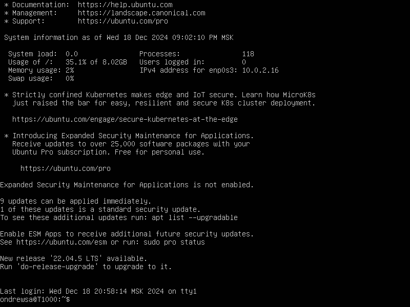  
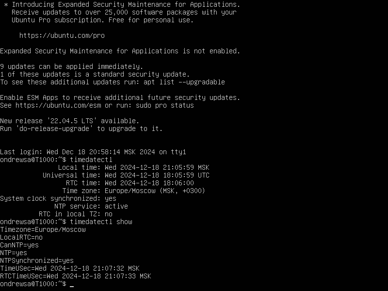  

## Part 7. Установка и использование текстовых редакторов   

* Создание и редактирование файлов.  

Создаем файл командой vim test_vim.txt. Для перехода в режим редактирования используется команда i.  
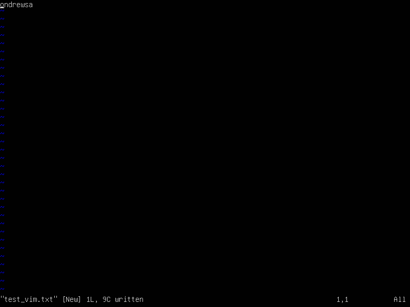  
Для выхода с сохранением изменений используется команда :wq.

Создаем файл командой nano test_nano.txt.  
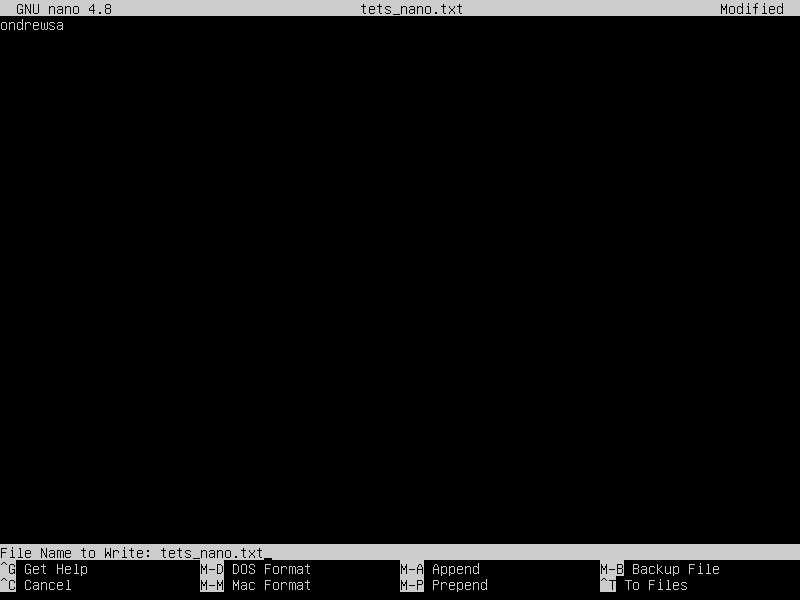  
Для сохранения изменений используется команда Ctrl+o.Для выхода - Ctrl+x.  

Создаем файл командой joe test_joe.txt.  
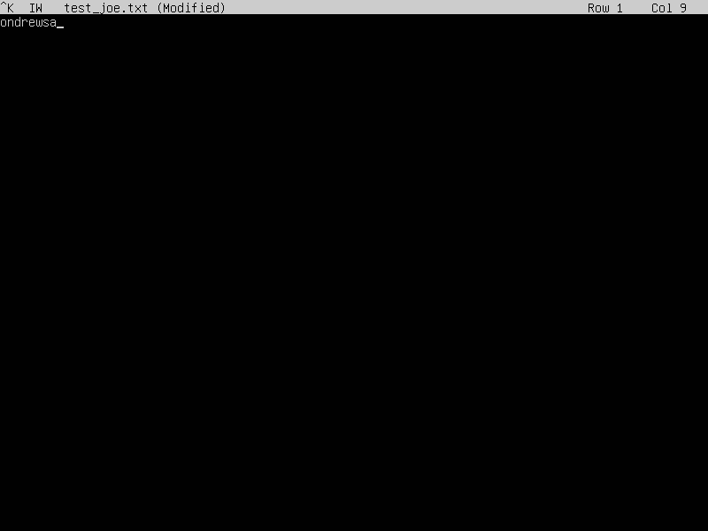  
Для сохранения изменений используется команда Ctrl+k. И для выхода - Х.

* Редактирование файлов без сохранения изменений.  

Открываем файл командой vim test_vim.txt.  
Для перехода в режим редактирования используется команда i.  
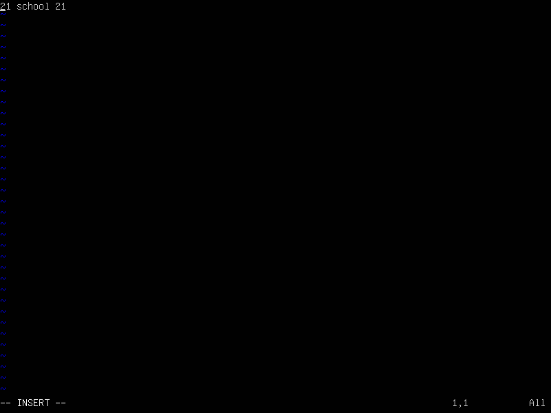  
Для выхода без сохранения изменения используется команда :q!  

Открываем файл командой nano test_nano.txt.  
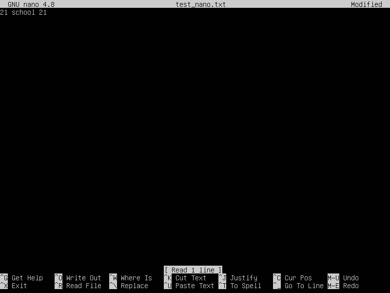  
Используем команду Ctrl+x для выхода из файла и на вопрос хотим ли мы не сохранять файл вводим no.  

Открываем файл командой joe test_joe.txt.  
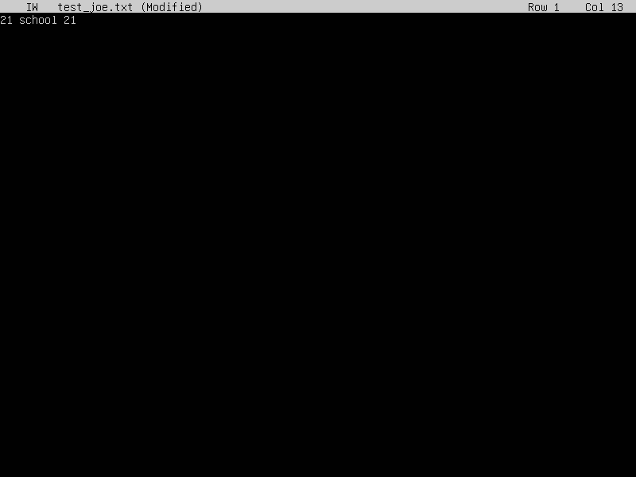  
Для того чтобы выйти без сохранения изменений используем команду Ctrl+c.

* Редактирование файла.Поиск и замена текста  

Открываем файл командой vim test_vim.txt. Переходим в режим команд (Esc)  
  
Для поиска с заменой набираем команду
:%s/world/John Connor/  
  

Открываем файл командой nano test_nano.txt.  
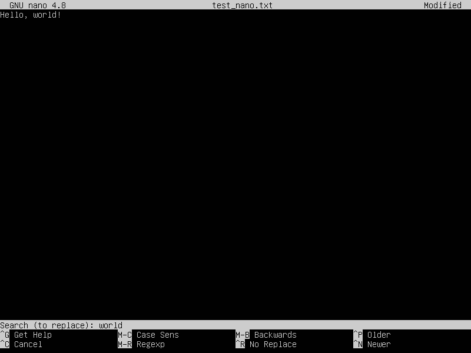    
Для поиска с заменой используется команда Ctrl+, вводим слово для поиска и Enter.  
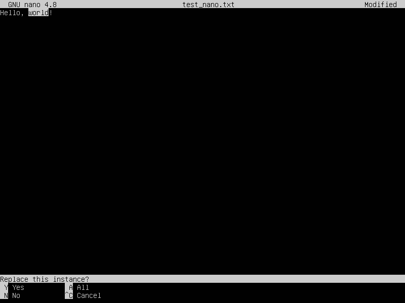  
и вводим текст на который происходит замена.  
  

Открываем файл командой joe test_joe.txt.  
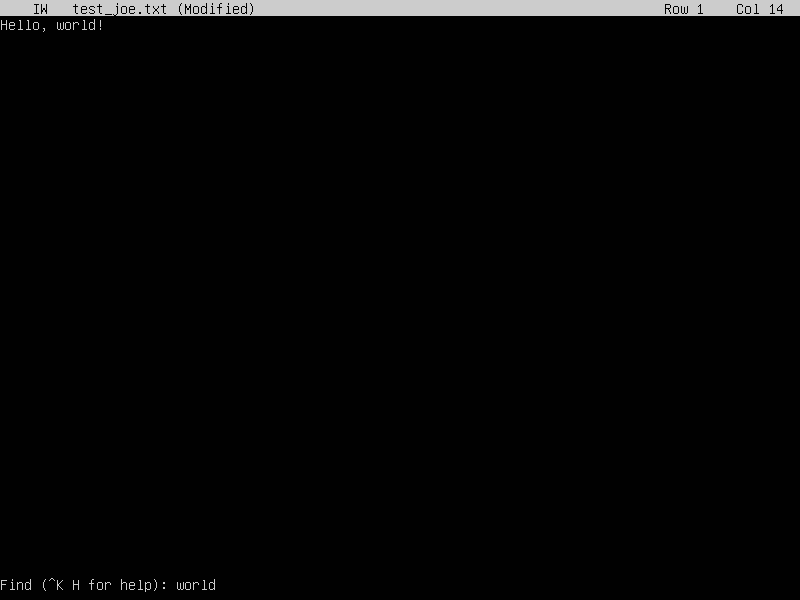  
Для поиска с заменой используется команда Ctrl+k,f вводим слово для поиска и Enter.  
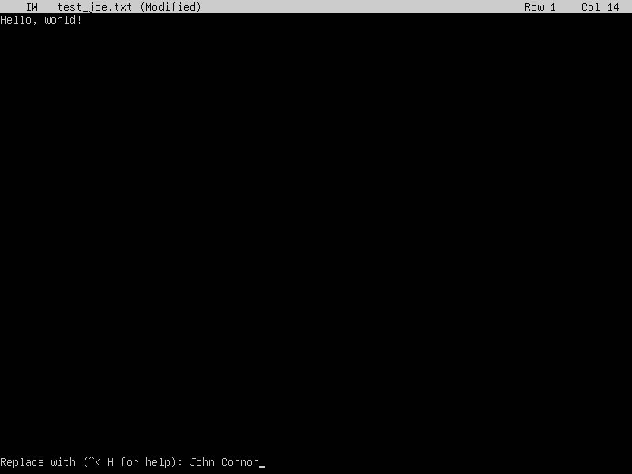  
и вводим текст на который происходит замена.  
  

## Part 8. Установка и базовая настройка сервиса SSHD  

* Установи службу SSHd.  

Установка SSH:  
  
Установка openSSH:  
  
Проверяем работу ssh-сервера:  
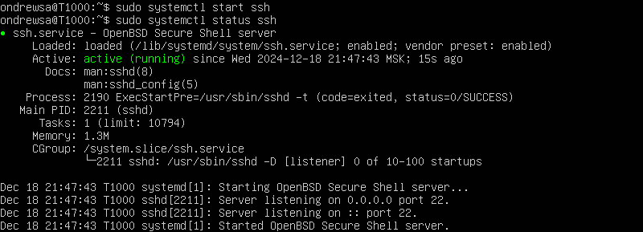  

* Добавь автостарт службы при загрузке системы.   

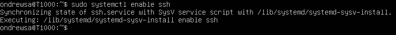  

* Перенастрой службу SSHd на порт 2022.  

Меняем порт в конфигурационном файле SSH сервера: sudo vim /etc/ssh/sshd_config  
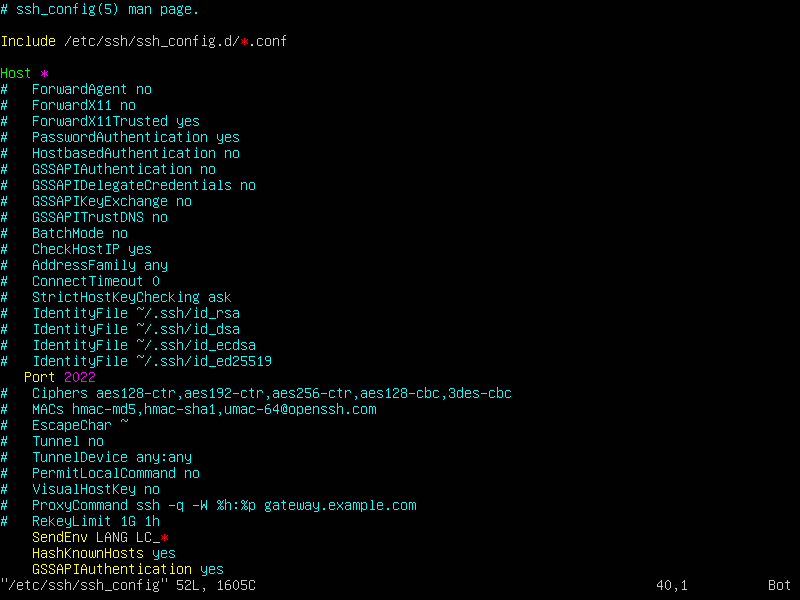  
Проверяем порт:  
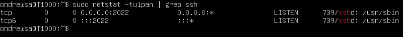  

* Используя команду ps, покажи наличие процесса sshd.  

Используем команду: ps -fL -C sshd.  
ps - показывает состояние процессов  
-f выводит максимум доступных данных, например, количество потоков  
-L отображает потоки процессов в колонках LWP(легковесный процесс) и NLWP(число легковесных процессов)  
-С выбирает процессы по имени команды.  
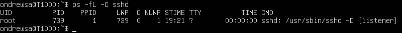  

Перезагружаем систему.  

Вводим команду netstat -tan.  
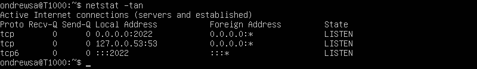  
netstat - показывает содержимое различных структур данных, связанных с сетью, в различных форматах в зависимости от указанных опций.  
-tan: вывод всех активных подключений TCP и прослушиваемых компьютером портов TCP и UDP + показывает сетевые адреса как числа.  

State: Listen - ожидает входящих соединений.  
Proto: протокол, используемый сокетом.  
Recv-Q: количество байтов, не скопированных пользовательской программой, подключенной к этому сокету.  
Send-Q: количество неподтвержденных байтов удаленного хоста.  
Local address: локальный адрес (имя локального хоста) и номер порта сокета.  
Foreign address: удаленный адрес (имя удаленного хоста) и номер порта сокета.  
0.0.0.0 - это немаршрутизируемый адрес IPv4, который можно использовать в разных целях, в основном, в качестве адреса по умолчанию или адреса-заполнителя. Несмотря на то, что адрес 0.0.0.0 может использоваться в компьютерных сетях, он не является адресом какого-либо устройства.  

## Part 9. Установка и использование утилит top, htop  

* Устанавливаем утилиту top: sudo apt install top.  
* Вывод утилиты top:  
  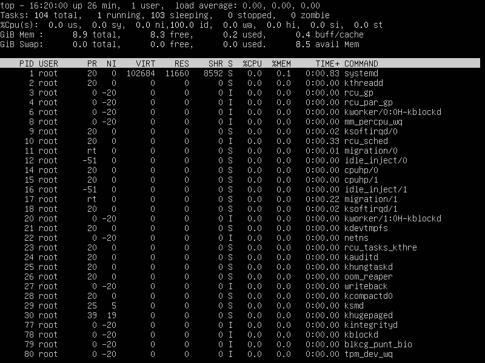  
Uptime - 26 минут.  
Количество авторизованных пользователей - 1.  
Средняя загрузка системы - (0.00, 0.00, 0.00).  
Загрузка процессора:  
Пользовательские процессы занимают 0% от общего времени работы процессора.  
Системные процессы потребляют 0%.  
Процессор простаивает 100% времени.  
Остальное время (0%) уходит на другие незначительные операции.  
Загрузка памяти:  
Общее количество памяти (total): 8.9 Общий объем физической оперативной памяти в гигабайтах.  
Свободная память (free):  8.3 Количество свободной оперативной памяти, доступной для новых процессов в гигабайтах.  
Используемая память (used): 0.2 Объем оперативной памяти, занятый процессами в гигабайтах.  
Буфер и кэш (buff/cache): Память, используемая операционной системой для буферизации и кеширования данных. Этот объем памяти может быть освобожден при необходимости для новых процессов.  
Доступная память (avail Mem): Оценочное количество оперативной памяти, доступное для нового процесса без освобождения дополнительной памяти.  
PID-1 процесса занимающего больше всего памяти. Загрузка процессорного времени около 0%.  
* Вывод htop.  
  Отсортированный по PID:  
  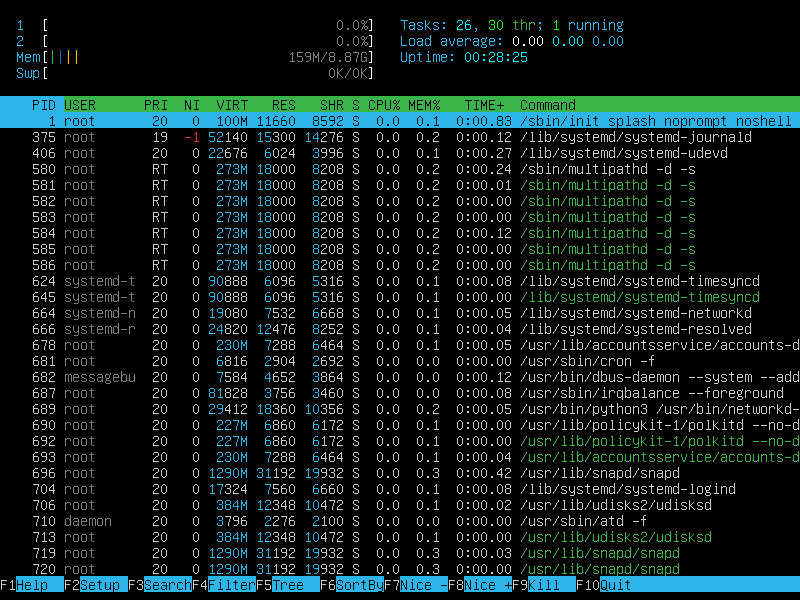  
  Отсортированный по PERCENT_CPU:  
  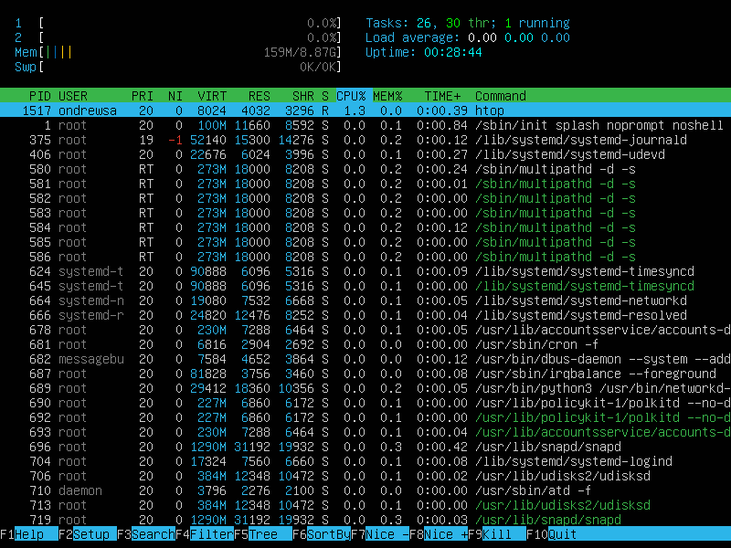  
  Отсортированный по PERCENT_MEM:  
  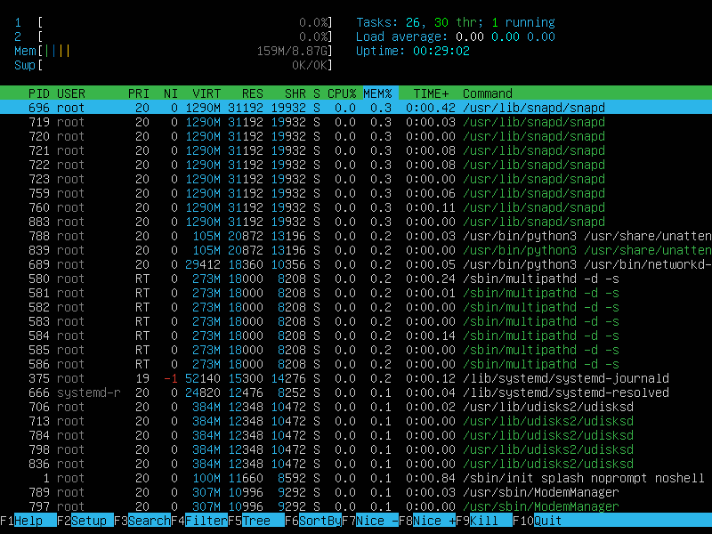  
  Отсортированный по TIME:  
  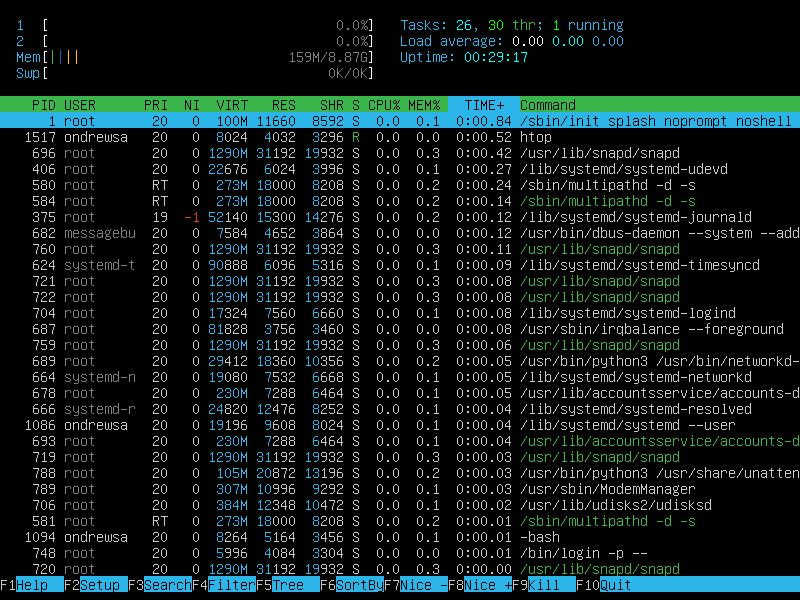  
  Для фильтра по процеесу sshd нажимаем F4 и вводим название нужного процесса:  
  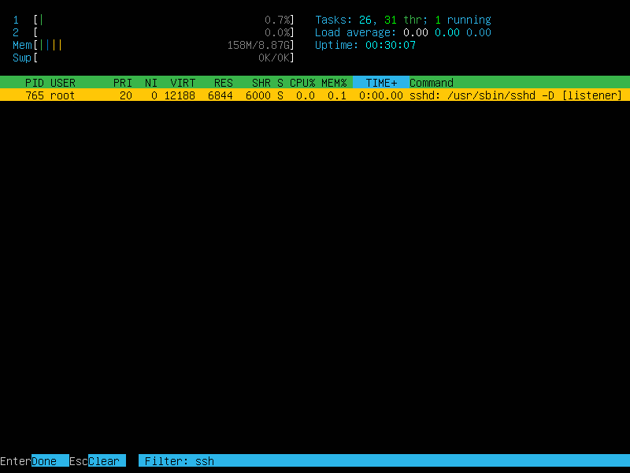  
  Для поиска процесса syslog нажимаем F3 и искомое имя:  
  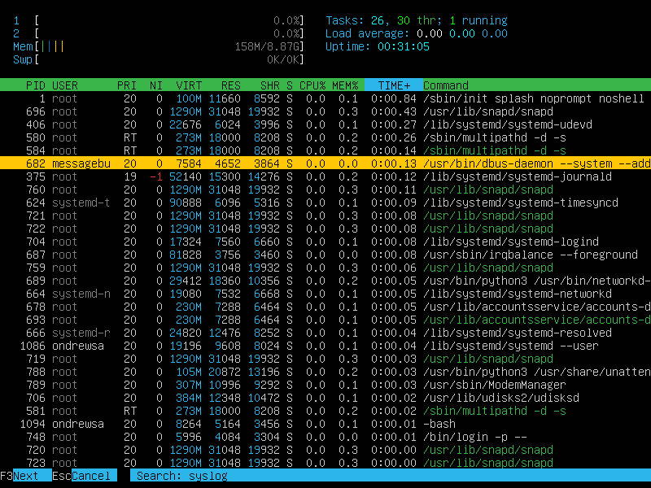  
  Для коррекции вывода нажимаем F2 и вносим нужные коррективы:  
  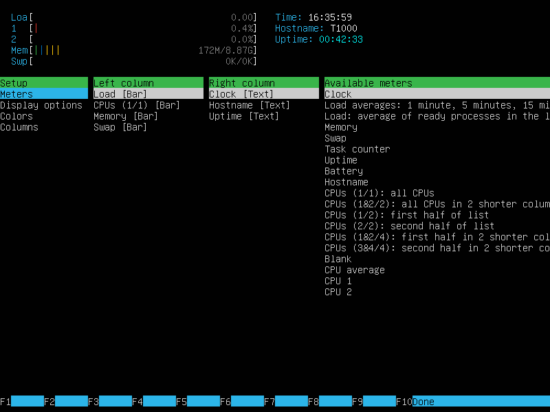  

  ## Part 10. Использование утилиты fdisk.  

* Вывод команды sudo fdisk -l:  
  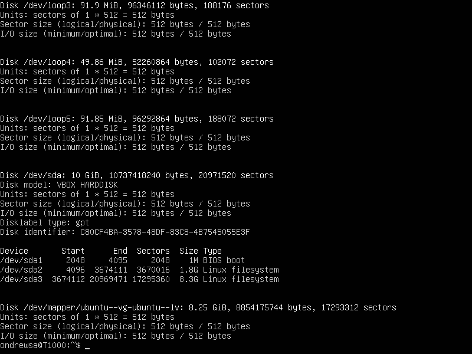  
название жесткого диска: /dev/sda/  
память 10 Гигабайт  
20971520 секторов  
swap отсутствует  

  ## Part 11. Использование утилиты df.  

* Вывод команды df:  
  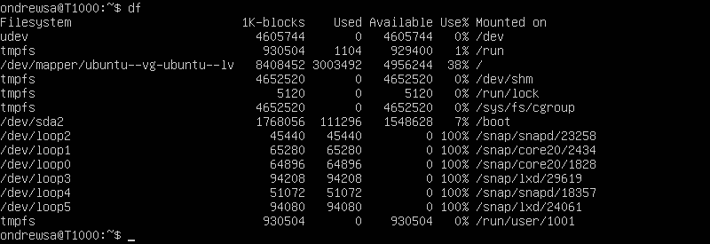  
  размер раздела - 1768056 кБ 
  размер занятого пространства - 111296 кБ 
  размер свободного пространства - 1548628 кБ  
  процент использования - 7  

* Вывод команды df -Th:  
  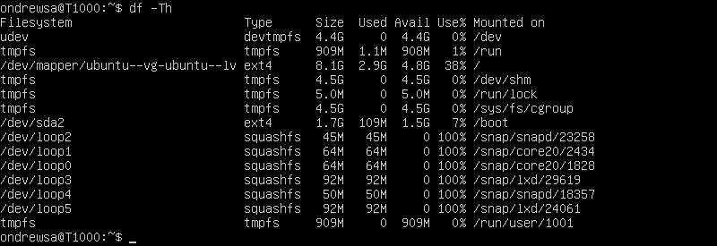  
  размер раздела - 1.7 ГБ  
  размер занятого пространства - 109 МБ  
  размер свободного пространства - 1.5 ГБ  
  тип файловой системы - ext4  

  ## Part 12. Использование утилиты du  

* Вывод команды du(размер папок в человекочитаемом виде):  
  /home  
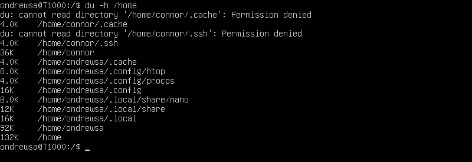  
  /var  
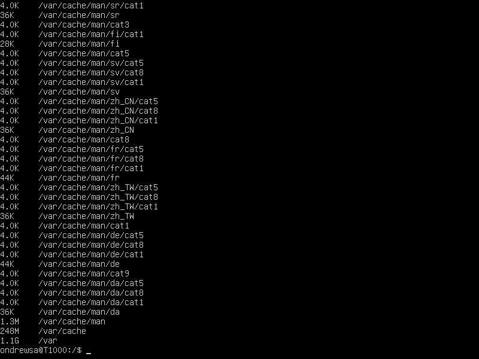  
  /var/log  
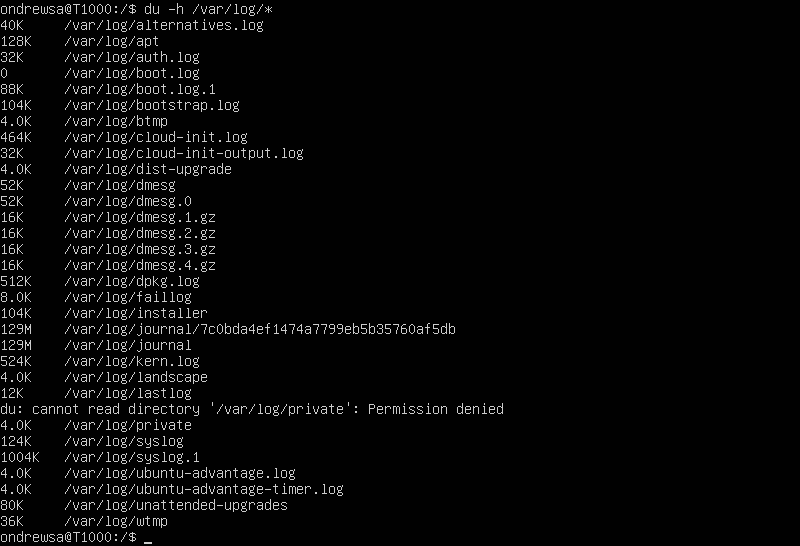  
* вывод размера всего содержимого /var/log для всех вложенных элементов  
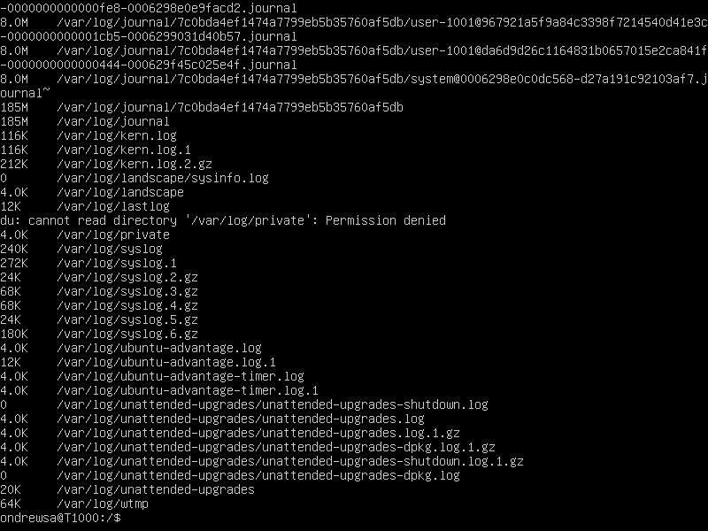  

## Part 13. Установка и использование утилиты ncdu  

 Установка: sudo apt-get install ncdu.

 * Вывод команды ncdu:

  /home  
  
  /var  
  
  /var/log  
  

## Part 14. Работа с системными журналами  

* Вывод sudo less auth.log:  
  

* Вывод sudo less syslog:  
  

* Вывод sudo less /var/log/auth.log:  
  
Время последней авторизации: 21 декабря 16:30:39. Пользователь ondrewsa.  
* Перезапускаем службу SSH. Вывод sudo less /var/log/auth.log после перезапуска:  
  

## Part 15. Использование планировщика заданий **CRON**  

Устанавливаем Crontab  sudo apt install cron.  
Создание файла с заданием: crontab -e.  
Создаем запись для выполнения команды Uptime каждые 2 минуты: */2 * * * * uptime.  
* Открываем файл заданий: oem@Laptop:~$ crontab -l.  
  
* Отчет о выполнении Cron:  
  
* Удаляем все задачи планировщика и выводим текущие задачи:  
