# Сети в Linux 
____________
[Part 1. Инструмент ipcalc](#part-1-инструмент-ipcalc)  
[Part 2. Статическая маршрутизация между двумя машинами](#part-2-статическая-маршрутизация-между-двумя-машинами)  
[Part 3. Утилита iperf3](#part-3-утилита-iperf3)  
[Part 4. Сетевой экран](#part-4-сетевой-экран)  
[Part 5. Статическая маршрутизация сети](#part-5-статическая-маршрутизация-сети)  

## Part 1. Инструмент ipcalc  

1.1. Сети и маски

1)  Адрес сети 192.167.38.54/13
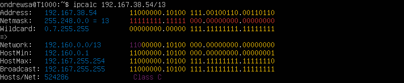  
2) Перевод маски 255.255.255.0 в префиксную и двоичную запись, /15 в обычную и двоичную, 11111111.11111111.11111111.11110000 в обычную и
префиксную.    
  
* 255.255.255.0 - Префиксная: /24. Двоичная: 11111111.11111111.11111111.00000000  
  
* /15 в обычной записи - 255.254.0.0. В двоичной - 11111111.11111110.00000000.00000000.  
  
* 11111111.11111111.11111111.11110000 в обычной записи 255.255.255.240. В префиксной - /28  
  
3) Минимальный и максимальный хост в сети 12.167.38.4 при масках: /8, 11111111.11111111.00000000.00000000, 255.255.254.0 и /4  

* 12.167.38.4/8:  
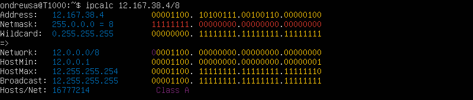  
* 12.167.38.4/11111111.11111111.00000000.00000000:  
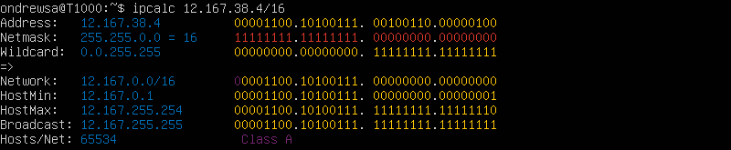  
* 12.167.38.4/255.255.254.0:  
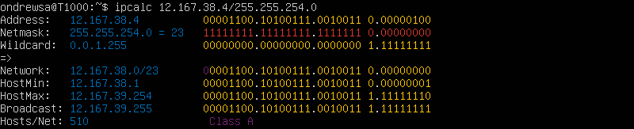  
* 12.167.38.4/4:  
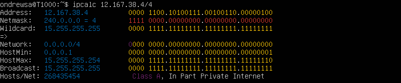  

1.2. localhost  

* Определи и запиши в отчёт, можно ли обратиться к приложению, работающему на localhost, со следующими IP: 194.34.23.100, 127.0.0.2, 127.1.0.1, 128.0.0.1.  
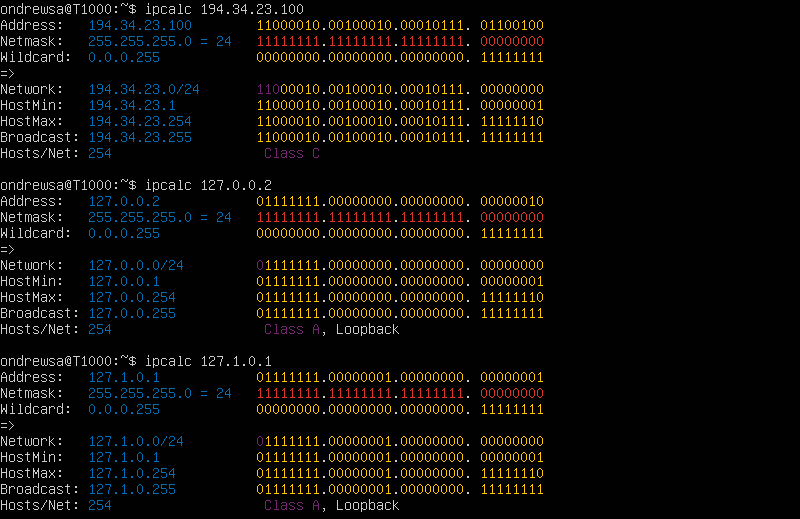  
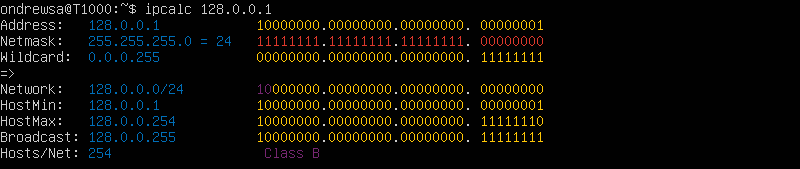  
Адреса помеченные lopback относятся к localhost.  

1.3. Диапазоны и сегменты сетей  

1) Какие из перечисленных IP можно использовать в качестве публичного, а какие только в качестве частных: 10.0.0.45, 134.43.0.2, 192.168.4.2, 172.30.250.4, 172.0.2.1, 192.172.0.1, 172.68.0.2, 172.16.255.255, 10.10.10.10, 192.169.168.1  
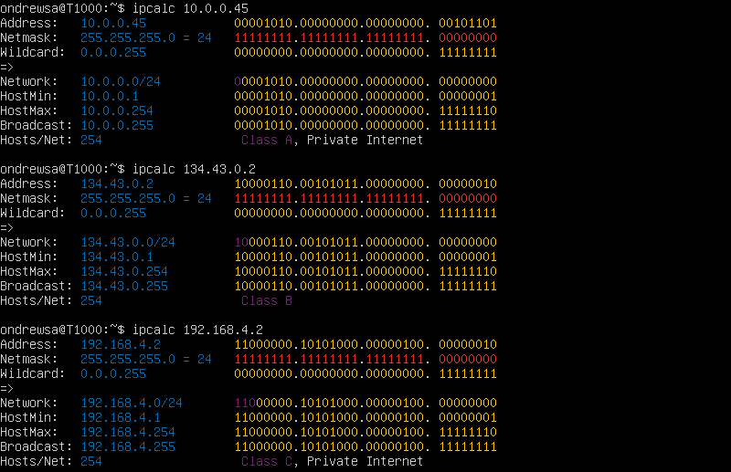  
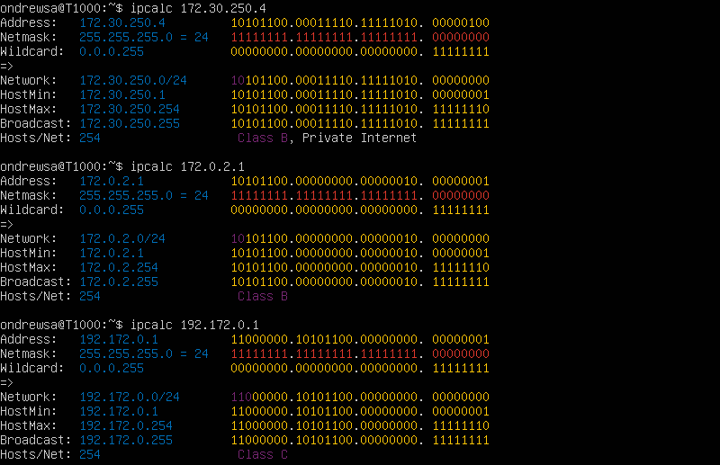  
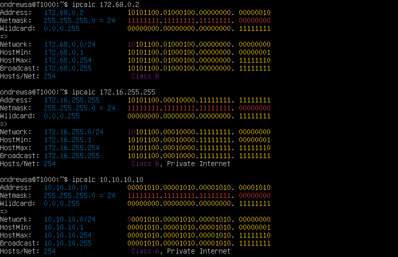  
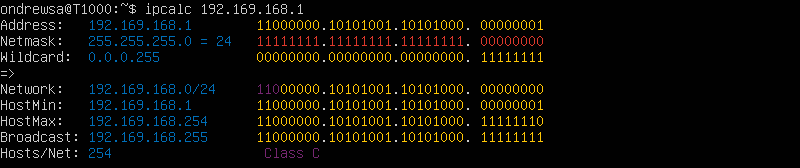  
В частную сеть входят: 10.0.0.45, 192.168.4.2, 172.30.250.4, 172.16.255.255.  

2) Какие из перечисленных IP-адресов шлюза возможны у сети 10.10.0.0/18: 10.0.0.1, 10.10.0.2, 10.10.10.10, 10.10.100.1, 10.10.1.255  
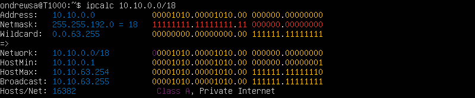  
Входят: 10.10.0.2, 10.10.10.10. 10.10.1.255 не входит, т.к. является широковещательным.  

## Part 2. Статическая маршрутизация между двумя машинами  

    Статическая маршрутизация подходит для простых сценариев, где конфигурация сети остаётся относительно постоянной.  

* Командой ip a смотрим сетевые интерфейсы.
Для ws1:  
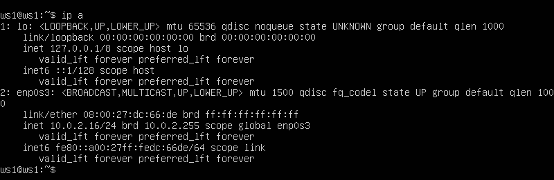  
Для ws2:  
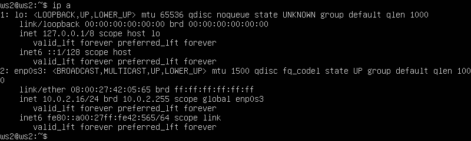  

* Опиши сетевой интерфейс, соответствующий внутренней сети, на обеих машинах и задай следующие адреса и маски: ws1 — 192.168.100.10,
маска /16, ws2 — 172.24.116.8, маска /12.  

Описываю сетевой интерфейс. Для ws1:  
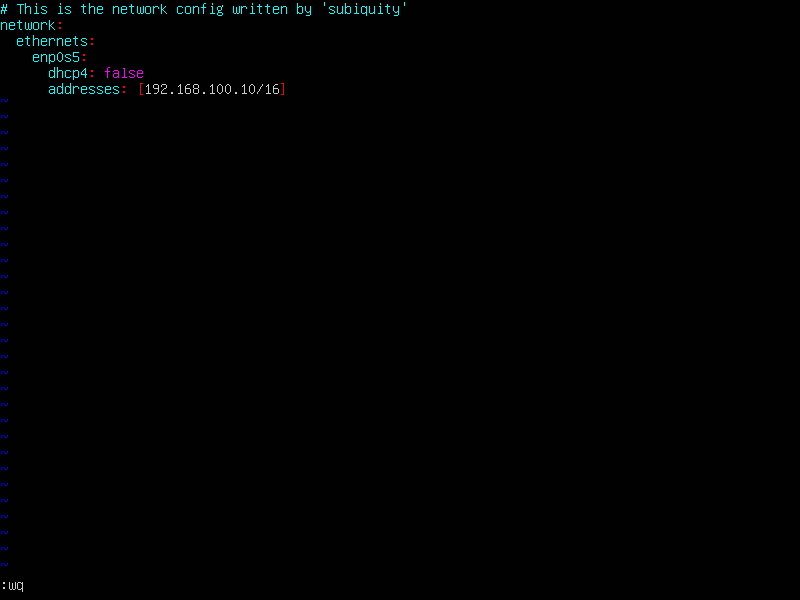  
Для ws2:  
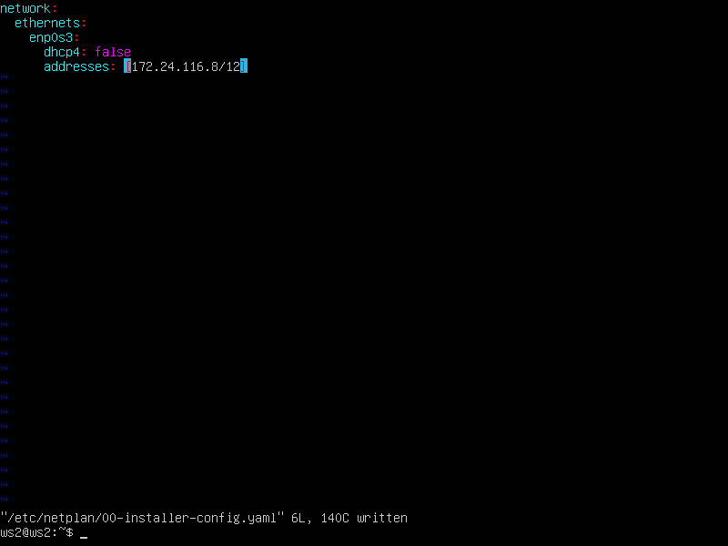  

* Выполни команду netplan apply для перезапуска сервиса сети.
Для ws1:  
  
Для ws2:  
  

2.1. Добавление статического маршрута вручную  

* Добавь статический маршрут от одной машины до другой и обратно при помощи команды вида ip r add.  
Для ws1:  
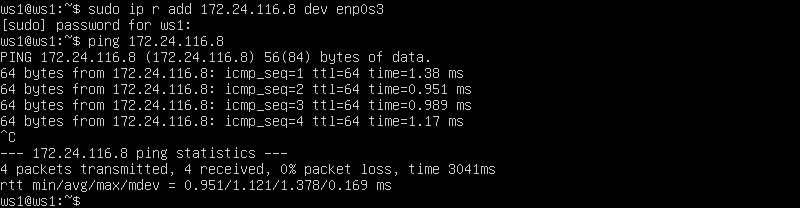  
Для ws2:  
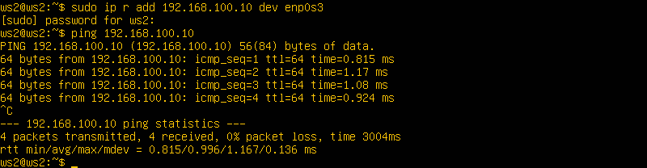  

2.2. Добавление статического маршрута с сохранением  

* Добавь статический маршрут от одной машины до другой с помощью файла /etc/netplan/00-installer-config.yaml.  
Для ws1:  
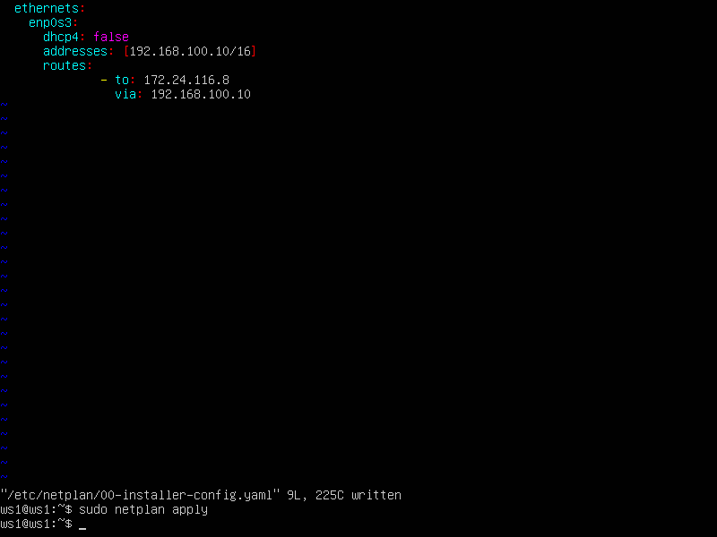  
Для ws2:  
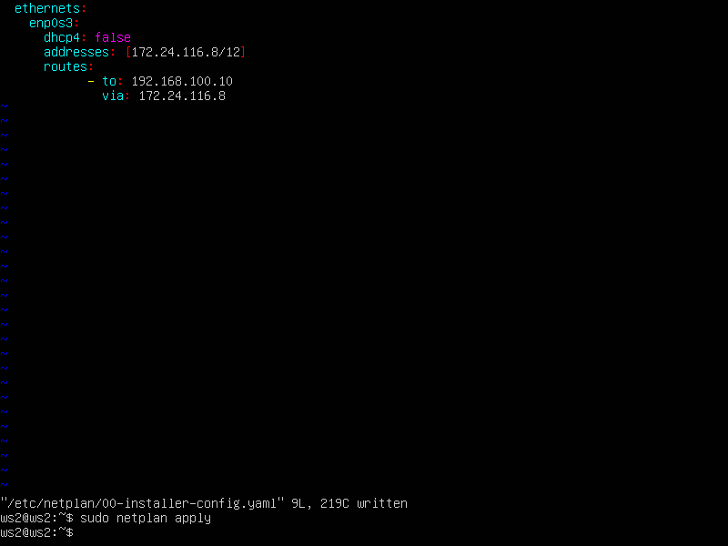  

* Пропингуй соединение между машинами.  

Для ws1:  
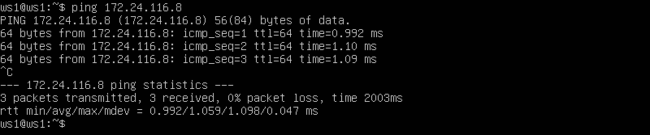  
Для ws2:  
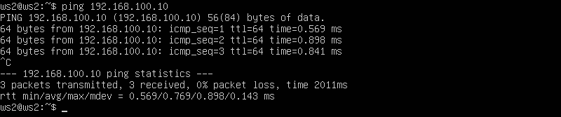  

## Part 3. Утилита iperf3  

3.1. Скорость соединения  

8 Mbps в MB/s = 8/1 = 1.  
100 MB/s в Kbps = 100*8*1024 = 819200.  
 1 Gbps в Mbps = 1024.  

 3.2. Утилита iperf3  

 * Измерь скорость соединения между ws1 и ws2.  
 
 Включаю серверную часть на ws2:
 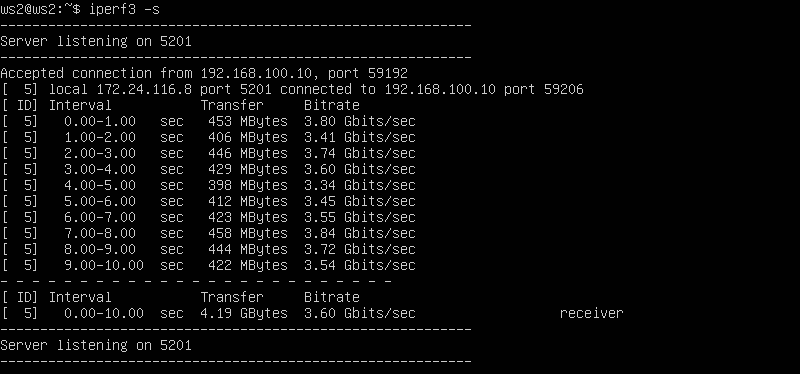  
 затем клиентскую на ws1:
 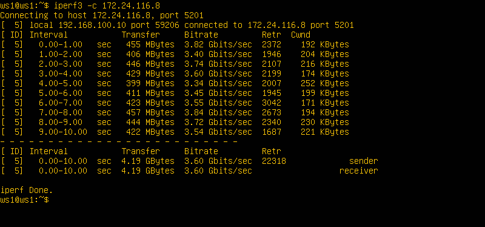  

 # Part 4. Сетевой экран  

4.1. Утилита iptables  

Нужно добавить в файл подряд следующие правила: 
1) На ws1 примени стратегию, когда в начале пишется запрещающее правило, а в конце пишется разрешающее правило (это касается пунктов 4 и 5). 
2) На ws2 примени стратегию, когда в начале пишется разрешающее правило, а в конце пишется запрещающее правило (это касается пунктов 4 и 5). 
3) Открой на машинах доступ для порта 22 (ssh) и порта 80 (http). 
4) Запрети echo reply (машина не должна «пинговаться», т. е. должна быть блокировка на OUTPUT). 
5) Разреши echo reply (машина должна «пинговаться»).  

Файл firewall.sh для ws1:  
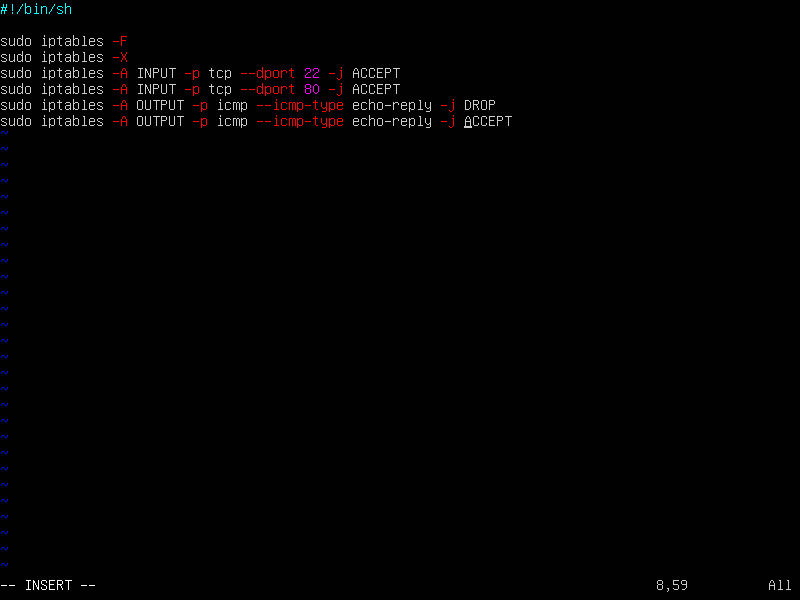  
Файл firewall.sh для ws2:  
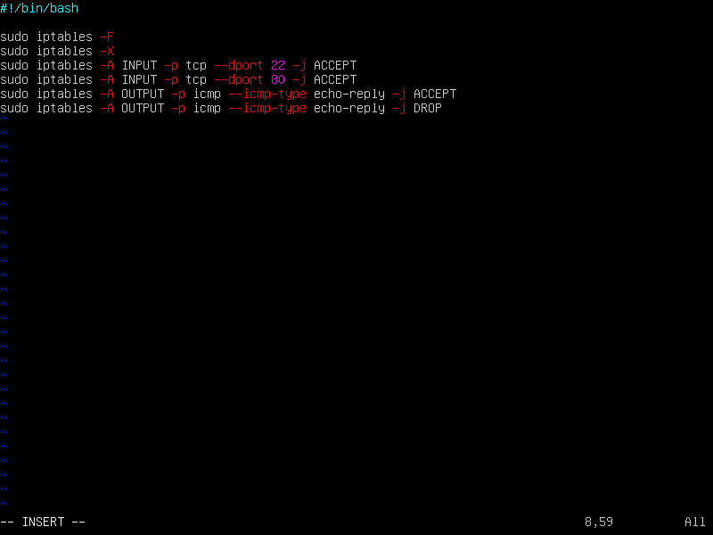  

* Запусти файлы на обеих машинах командами chmod +x /etc/firewall.sh и /etc/firewall.sh.  
Для ws1:  
  
  
Для ws2:  
  
  

        Стратегия такова: сначала открывается доступ к портам, затем в ws1 стоит запрещающее, а затем разрешающее. В ws2 - наоборот.  

4.2. Утилита nmap  

* Командой ping найди машину, которая не «пингуется», после чего утилитой nmap покажи, что хост машины запущен.  
Для ws1:  
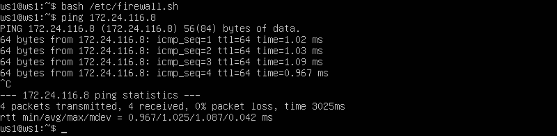  
Для ws2:  
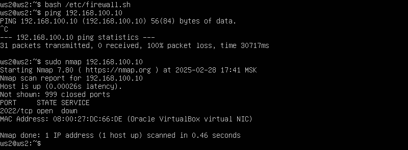  

* Сохрани дампы образов виртуальных машин  
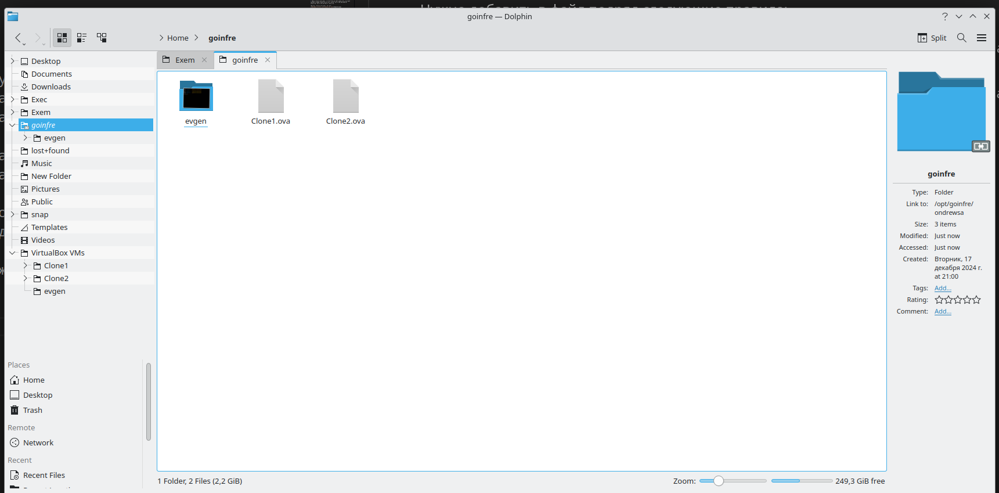  

## Part 5. Статическая маршрутизация сети  

