 # Simple Docker  
 ---  
[Part 1. Готовый докер](#part-1-готовый-докер)  
[Part 2. Операции с контейнером](#part-2-операции-с-контейнером)  
[Part 3. Мини веб-сервер](#part-3-мини-веб-сервер)  
[Part 4. Свой докер](#part-4-свой-докер)  
[Part 5. Dockle](#part-5-dockle)  
[Part 6. Базовый Docker Compose](#part-6-базовый-docker-compose)  

  
---
## Part 1. Готовый докер  
---

* Возьми официальный докер-образ с nginx и выкачай его при помощи docker pull.  
Установка nginx:  
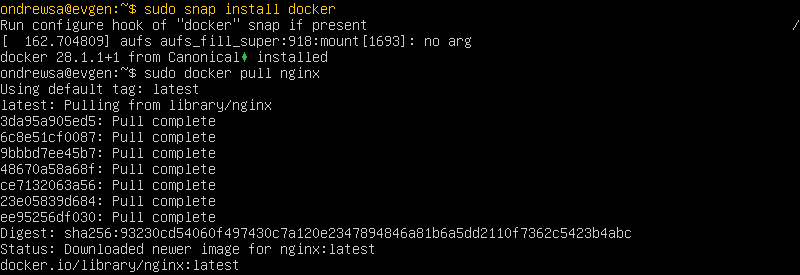  

* Проверь наличие докер-образа через docker images.  
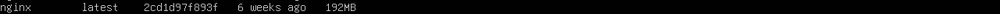  

* Запусти докер-образ через docker run -d [image_id|repository].  
Запуск докер-образа:  
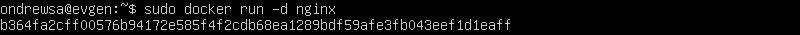  

* Проверь, что образ запустился через docker ps.  
Проверка запуска образа:  
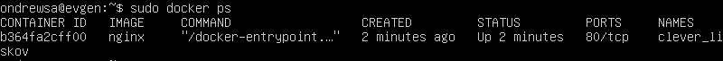  

* Посмотри информацию о контейнере через docker inspect [container_id|container_name].  
Просмотр информации о контейнере:  
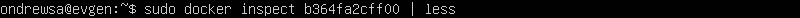  
и вывод результата:  
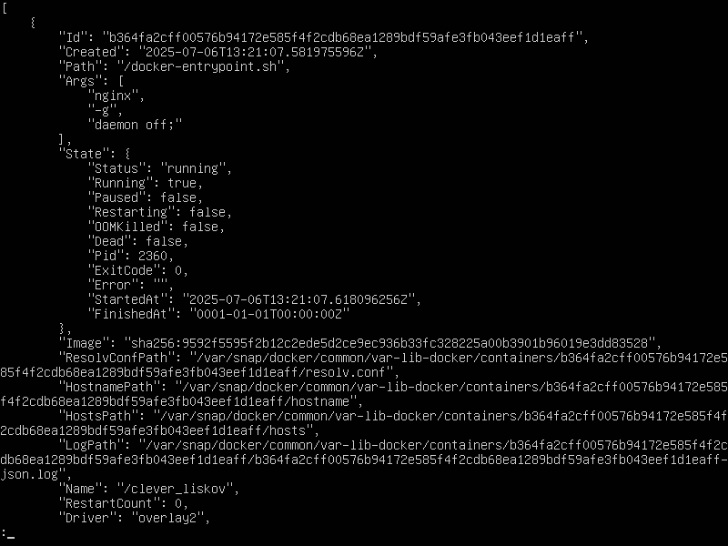  
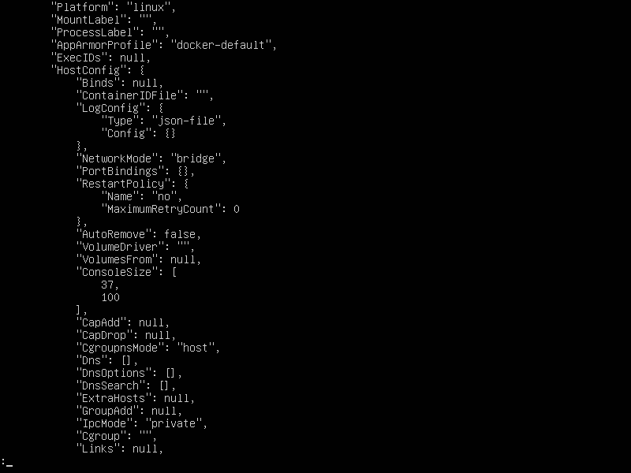  
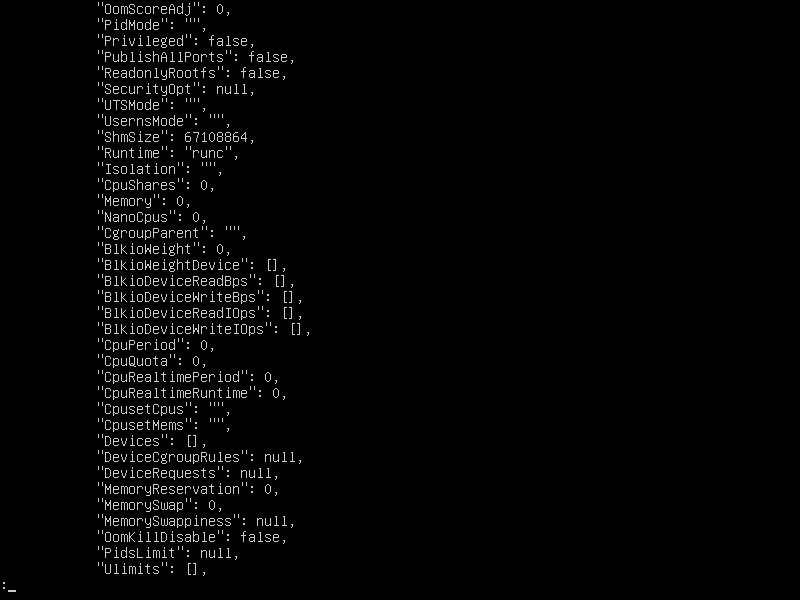  
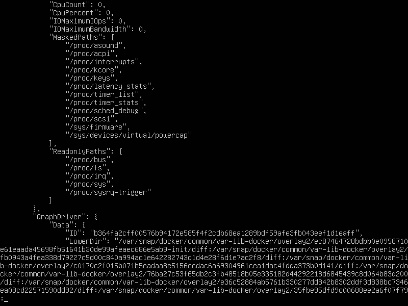  
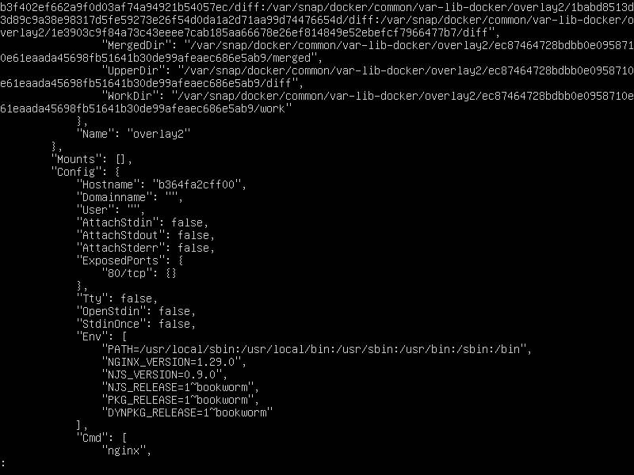  
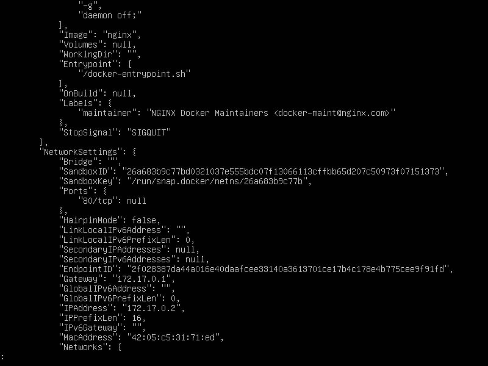  
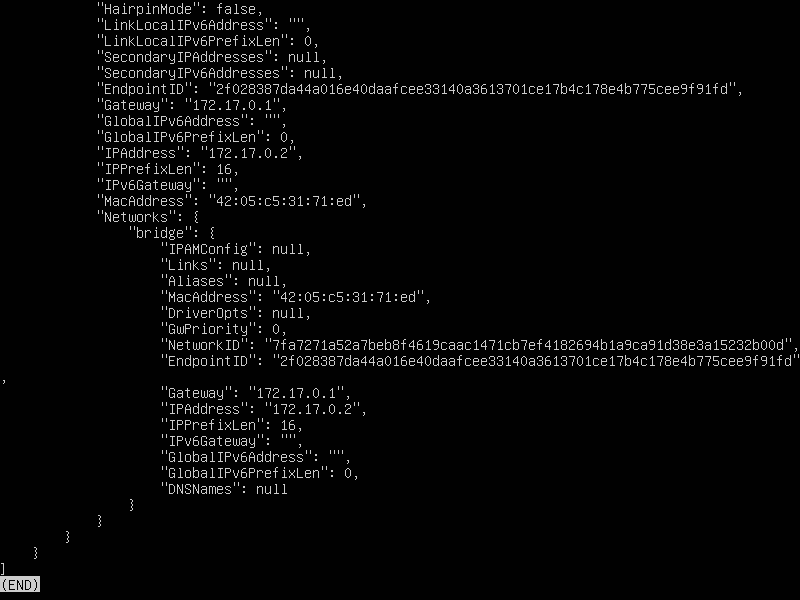  

* По выводу команды определи и помести в отчёт размер контейнера, список замапленных портов и ip контейнера.  
Размер контейнера: 1.095 кБ  
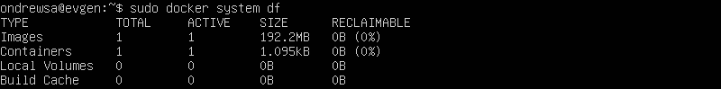  
Замапленный порт: 80  
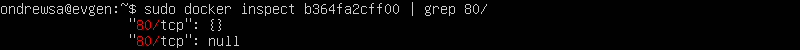  
IP адрес контейнера: 172.17.0.2  
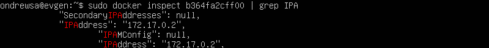  

* Останови докер контейнер через docker stop [container_id|container_name].  
Останавливаем контейнер:  
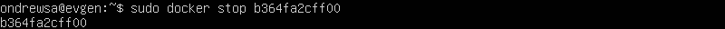  

* Проверь, что контейнер остановился через docker ps.  
Проверяем остановку контейнера:  
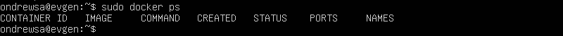  

* Запусти докер с портами 80 и 443 в контейнере, замапленными на такие же порты на локальной машине, через команду run.  
Запускаем контейнер с замапленными портами:  
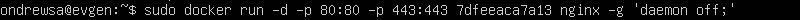  

* Проверь, что в браузере по адресу localhost:80 доступна стартовая страница nginx.  
Проверяем стартовую страницу nginx:  
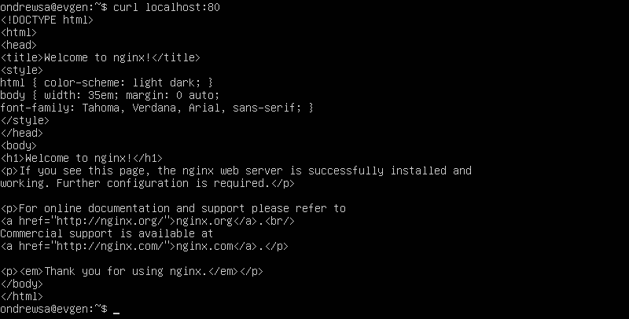  

* Перезапусти докер контейнер через docker restart [container_id|container_name].  
Перезапускаем контейнер:  
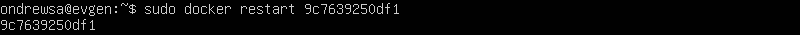  

* Проверь любым способом, что контейнер запустился.  
Проверяем запуск контейнера:  
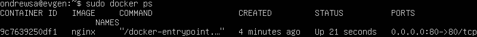  

---
## Part 2. Операции с контейнером
---

* Прочитай конфигурационный файл nginx.conf внутри докер контейнера через команду exec.  
Читаем nginx.conf  
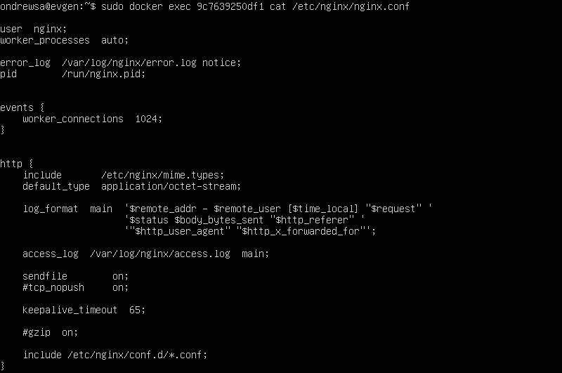  

* Создай на локальной машине файл nginx.conf.  
Создем файл конфигурации:  
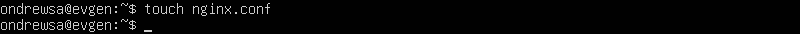  

* Настрой в нем по пути /status отдачу страницы статуса сервера nginx.  
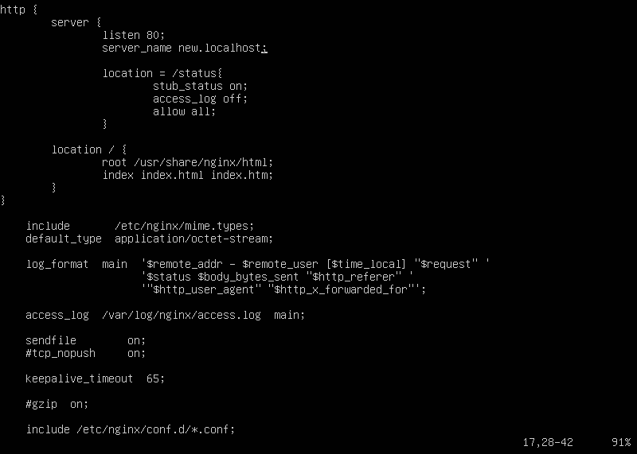  

* Скопируй созданный файл nginx.conf внутрь докер-образа через команду docker cp.  
Копируем конфигурацию nginx:  
  

* Перезапусти nginx внутри докер-образа через команду exec.  
Перезапускаем nginx:  
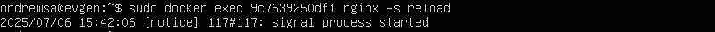  

* Проверь, что по адресу localhost:80/status отдается страничка со статусом сервера nginx.  
Провреяем статус nginx:  
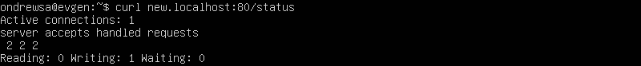  

* Экспортируй контейнер в файл container.tar через команду export.  
Экспортируем контейнер:  
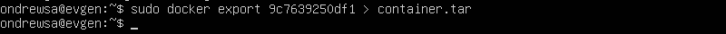  

* Останови контейнер.  
Останавливаем контейнер:  
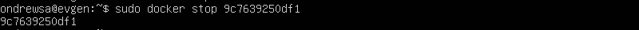  

* Удали образ через docker rmi [image_id|repository], не удаляя перед этим контейнеры.  
Удаляем образ:  
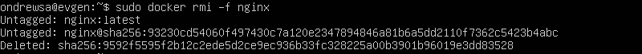  

* Удали остановленный контейнер.  
Удаляем контейнер:  
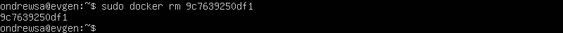  

* Импортируй контейнер обратно через команду import.  
Импортируем контейнер:  
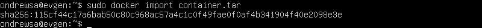  

* Запусти импортированный контейнер.  
Запускаем импортированный контейнер:  
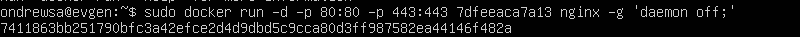  

* Проверь, что по адресу localhost:80/status отдается страничка со статусом сервера nginx.  
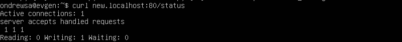  
  

---
## Part 3. Мини веб-сервер  
---
  
* Напиши мини-сервер на C и FastCgi, который будет возвращать простейшую страничку с надписью Hello World!.  
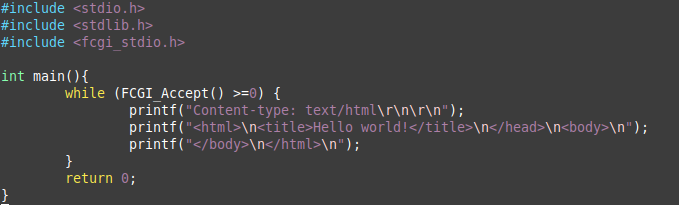  

* Запусти написанный мини-сервер через spawn-fcgi на порту 8080.  
Запускаю сервер spawn-cgi на порту 8080:  
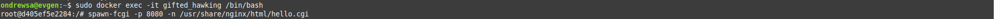  

* Напиши свой nginx.conf, который будет проксировать все запросы с 81 порта на 127.0.0.1:8080.  
Конфигурационный файл default.conf:  
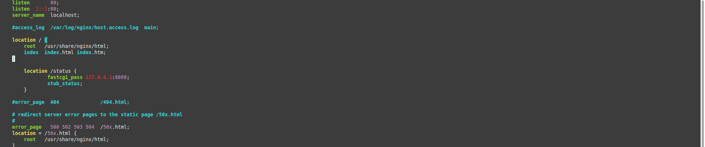  

* Проверь, что в браузере по localhost:81 отдается написанная тобой страничка.  
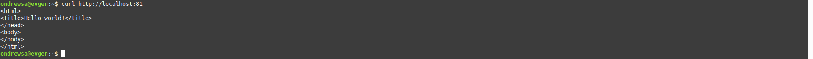  
  
---
# Part 4. Свой докер  
---
  
* Напиши свой докер-образ, который:  

1) собирает исходники мини сервера на FastCgi из Части 3;  

2) запускает его на 8080 порту;  

3) копирует внутрь образа написанный ./nginx/nginx.conf;  

4) запускает nginx.  
nginx можно установить внутрь докера самостоятельно, а можно воспользоваться готовым образом с nginx'ом, как базовым.

Текст скрипта создающего докер-образ Dockerfile:  
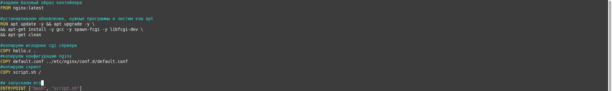  
и запускаемого при старте докер-образа скрипта:
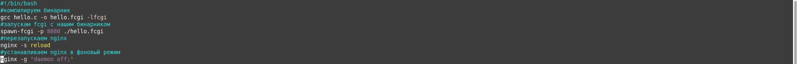  

* Собери написанный докер-образ через docker build при этом указав имя и тег.
Текст скрипта запускающего сборку докер-образа builddocker.sh:  
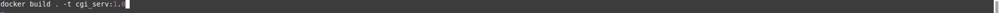  
и результат его выполнения:  
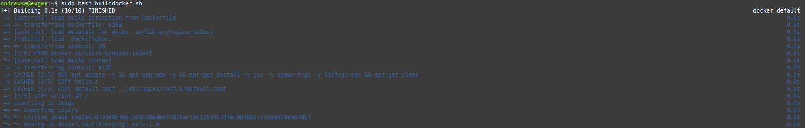  

* Проверь через docker images, что все собралось корректно.  
  

* Запусти собранный докер-образ с маппингом 81 порта на 80 на локальной машине и маппингом папки ./nginx внутрь контейнера по адресу, где лежат конфигурационные файлы nginx'а (см. Часть 2).  
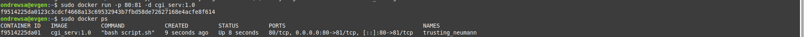  

* Проверь, что по localhost:80 доступна страничка написанного мини сервера.
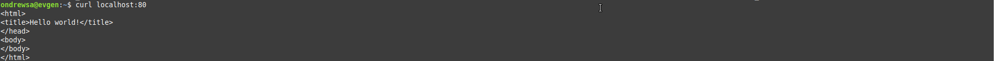  

* Допиши в ./nginx/nginx.conf проксирование странички /status, по которой надо отдавать статус сервера nginx.
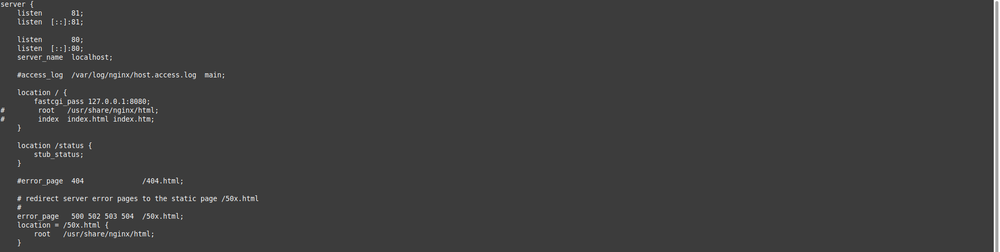  

* Перезапусти докер-образ.
Проверь, что теперь по localhost:80/status отдается страничка со статусом nginx  
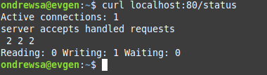  

---
## Part 5. Dockle  
---
  
* Просканируй образ из предыдущего задания через dockle [image_id|repository].  
установка dockle:  
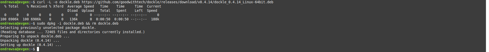  
Сканируем образ:  
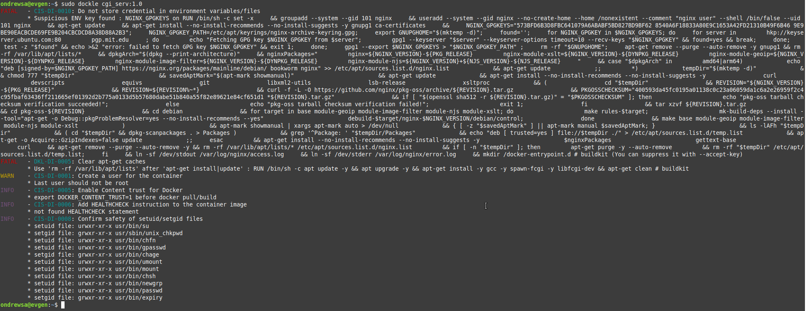  
Имеем две ошибки: 
1) ошибка в переменных окружения. Игнорируем ее в командной строке.
2) последняя команда выполняется от пользователя root. Решается путем добавления нового пользователя без прав root.  

* Исправь образ так, чтобы при проверке через dockle не было ошибок и предупреждений.
Исправленный Dockerfile:  
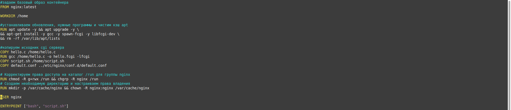  
и исправленный скрипт:  
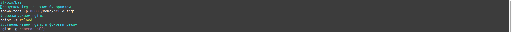  
  
Результат проверки dockle:  
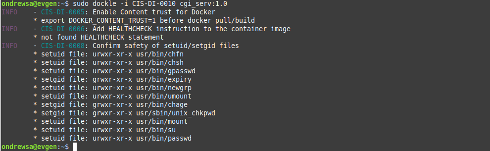  
  
---
## Part 6. Базовый Docker Compose
---

Напиши файл docker-compose.yml, с помощью которого:

1) Подними докер-контейнер из Части 5 (он должен работать в локальной сети, т. е. не нужно использовать инструкцию EXPOSE и мапить порты на локальную машину).

2) Подними докер-контейнер с nginx, который будет проксировать все запросы с 8080 порта на 81 порт первого контейнера.

* для запуска двух контейнеров в локальной сети пишем следующий docker-compose.yaml файл:  
  

* Замапь 8080 порт второго контейнера на 80 порт локальной машины.  
для этого пишем такой файл Cnginx.conf с настройками конфигурации nginx:  
  

Останови все запущенные контейнеры.

* Собери и запусти проект с помощью команд docker-compose build и docker-compose up.
Собираеем проект:  
  
запускаем его и проверяем что контейнеры работают:  
  

* Проверь, что в браузере по localhost:80 отдается написанная тобой страничка, как и ранее.  
  