# CI/CD  
---
[Part 1. Настройка gitlab-runner](#part-1-настройка-gitlab-runner)  

## Part 1. Настройка gitlab-runner  

* Подними виртуальную машину Ubuntu Server 22.04 LTS.  

* Скачай и установи на виртуальную машину gitlab-runner.  
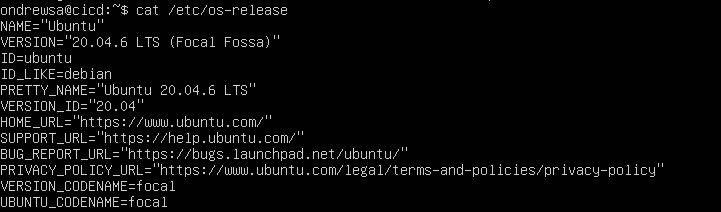  
  

* Запусти gitlab-runner и зарегистрируй его для использования в текущем проекте (DO6_CICD).  
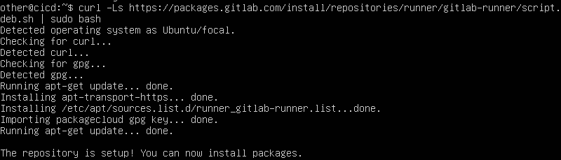  
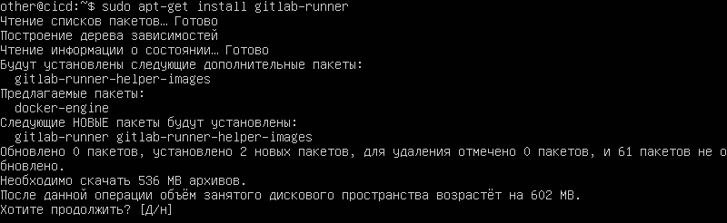  
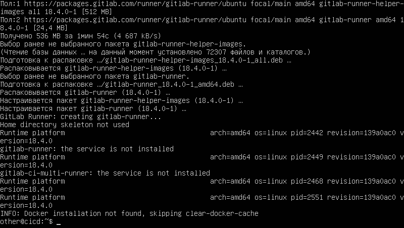  
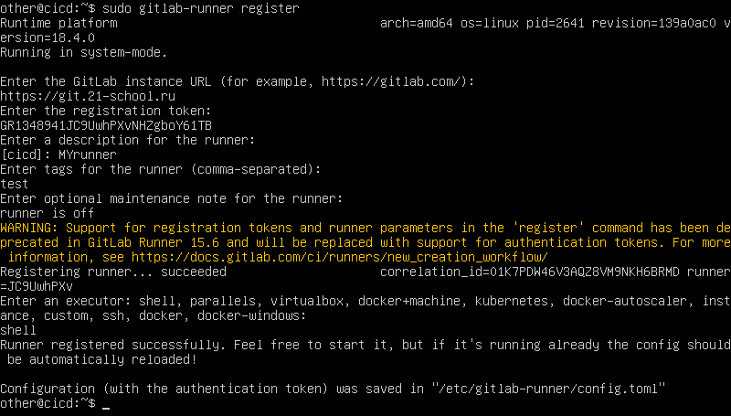  
  

Проверяем состояние gitlab-runner:  
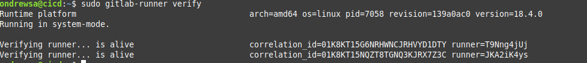  
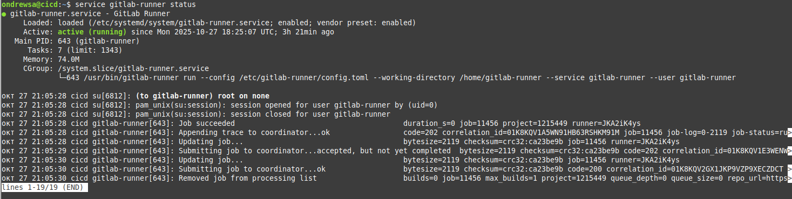  

## Part 2. Сборка

* Напиши этап для CI по сборке приложений из проекта SimpleBashUtils.
В файле .gitlab-ci.yml добавь этап запуска сборки через мейк файл из проекта SimpleBashUtils.
Файлы, полученные после сборки (артефакты), сохрани в произвольную директорию со сроком хранения 30 дней.

Создаем файл для сбоки: vim .gitlab-ci.yml  
  
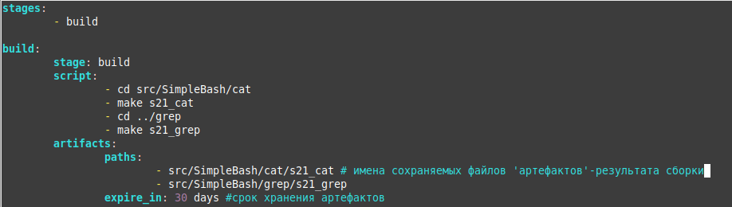  
Сборка выполнена успешно:  
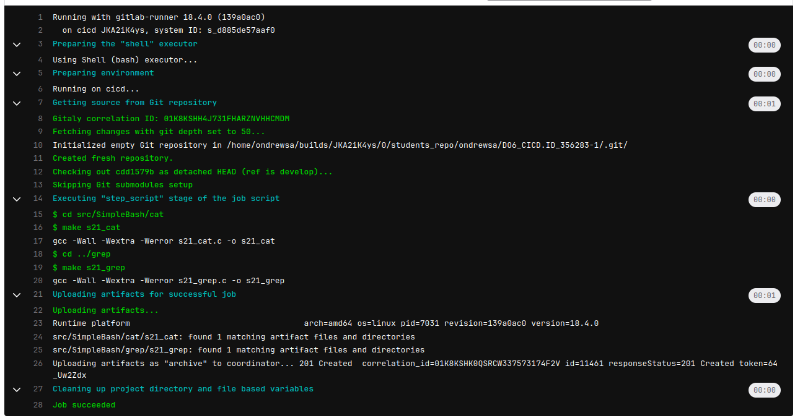  

## Part 3. Тест кодстайла

* Напиши этап для CI, который запускает скрипт кодстайла (clang-format).
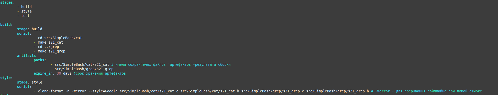  
* Если кодстайл не прошел, то «зафейли» пайплайн.  
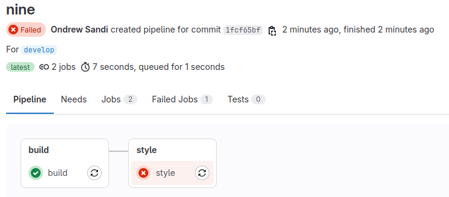  
* В пайплайне отобрази вывод утилиты clang-format.  
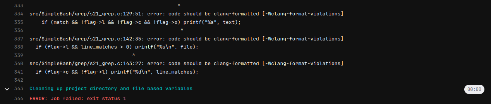  

Исправляем codestyle. Теперь пайплайн проходит успешно:  
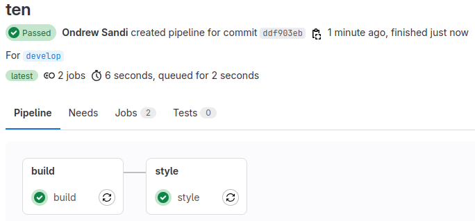  
  
## Part 4. Интеграционные тесты

* Напиши этап для CI, который запустит интеграционные тесты.
Если тесты не прошли, то «зафейли» пайплайн.
В пайплайне отобрази вывод, что интеграционные тесты успешно прошли / провалились.

Добавляем этап тестирования:  
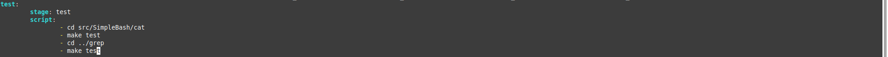  
Этап выполняется успешно:  
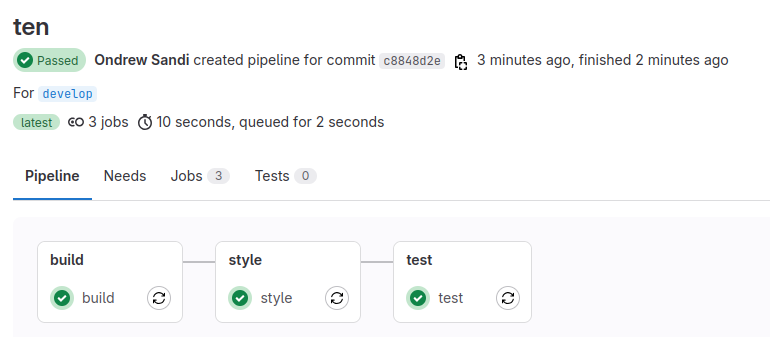  
  
Для проверки функциональности этапа тестировани вносим ошибку при завершении тестирования:  
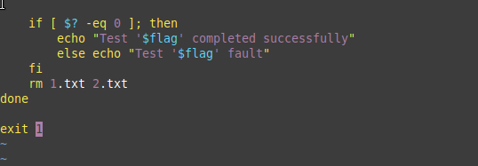  
Тесты завершаются ошибкой:  
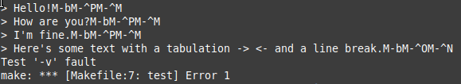  
Пайплайн фейлится:  
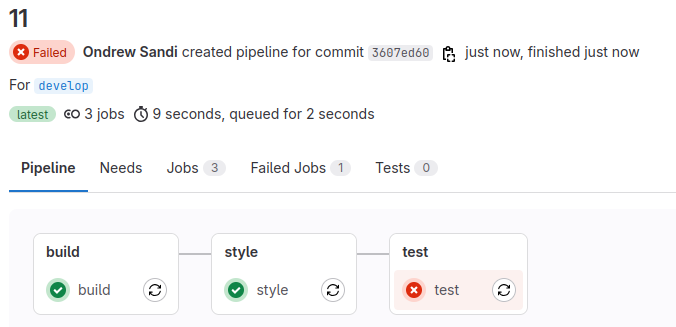  
После проверки функциональности тестирования возвращаем работоспособность тестов в исходное состояние.  
  
## Part 5. Этап деплоя

* Подними вторую виртуальную машину Ubuntu Server 22.04 LTS.  
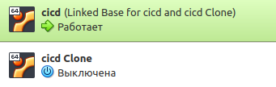  

* Напиши этап для CD, который «разворачивает» проект на другой виртуальной машине.  
Запусти этот этап вручную при условии, что все предыдущие этапы прошли успешно.  
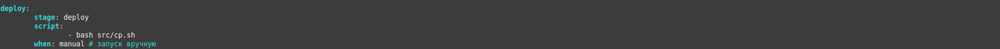  

Настраиваем сетевую конфигурацию netplan:  
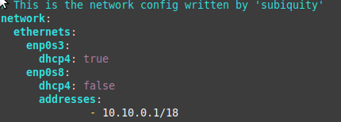  
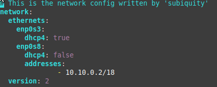  

Проверяем видимость машин друг другом:  
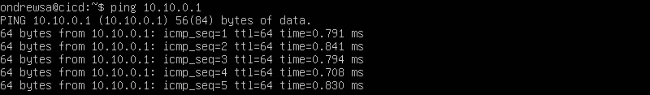  
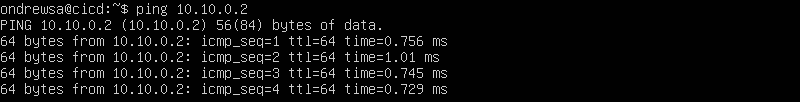  
  
* Напиши bash-скрипт, который при помощи ssh и scp копирует файлы, полученные после сборки (артефакты), в директорию /usr/local/bin второй виртуальной машины.  
Тут тебе могут помочь знания, полученные в проекте DO2_LinuxNetwork.  
Будь готов объяснить по скрипту, как происходит перенос.  
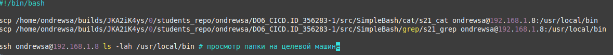  
  
Переключаемся на пользователя gitlab-runner:  
sudo su - gitlab-runner  
и генерируем ssh ключ:  
ssh-keygen  
  
копируем ssh на вторую машину:  
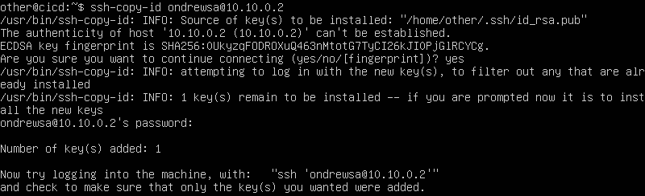  

предоставляем полный доступ к папке-цели на второй машине:  
  

В случае ошибки «зафейли» пайплайн.
В результате ты должен получить готовое к работе приложения из проекта SimpleBashUtils (cat и grep) или приложение из папки code-samples (DO) на второй виртуальной машине (в зависимости от того, что ты выполнял).
  
Пайплайн проходит успешно:  
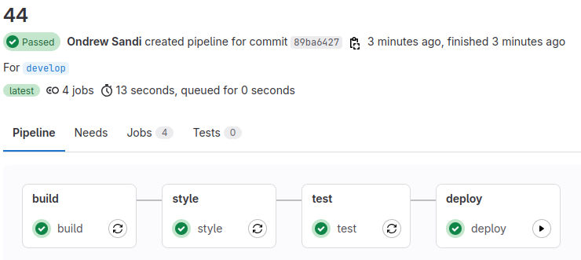  
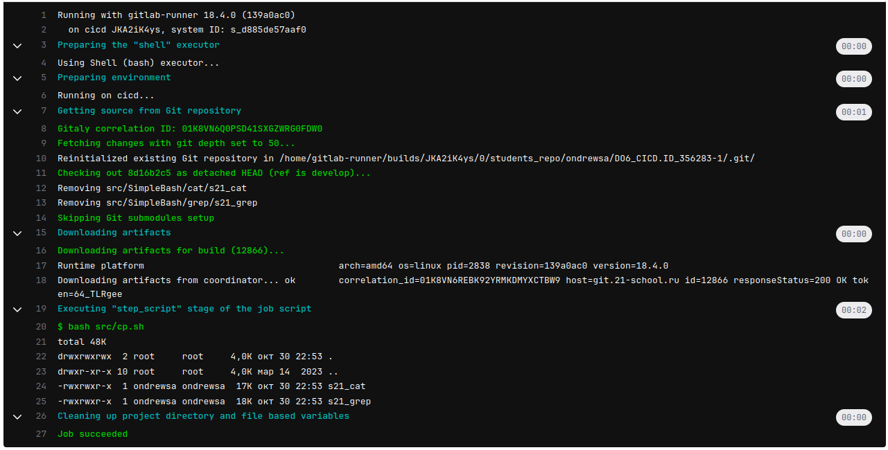   
  
Артефакты появляются в нужной директории:  
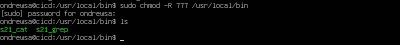  
  
* Сохрани дампы образов виртуальных машин.  

  
  

## Part 6. Дополнительно. Уведомления  

* Настрой уведомления об успешном/неуспешном выполнении пайплайна через бота с именем «[твой nickname] DO6 CI/CD» в Telegram.
Текст уведомления должен содержать информацию об успешности прохождения как этапа CI, так и этапа CD.
В остальном текст уведомления может быть произвольным.  

Создаем своего чат-бота в Telegram с помощью бота @BotFather:  
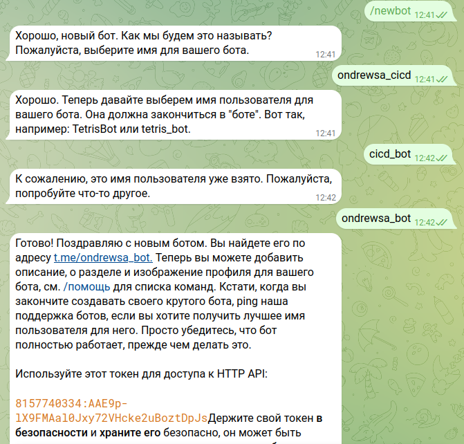  
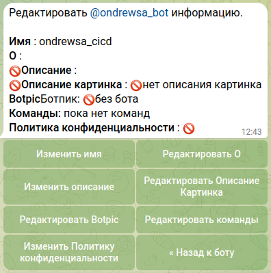  
  
скрипт для отправления сообщений в чат-бот:  
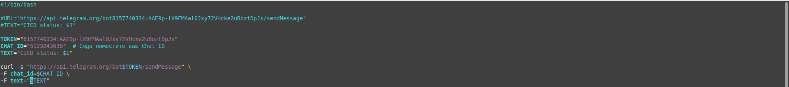  
  
Добавляем этапы отправки сообщений:  
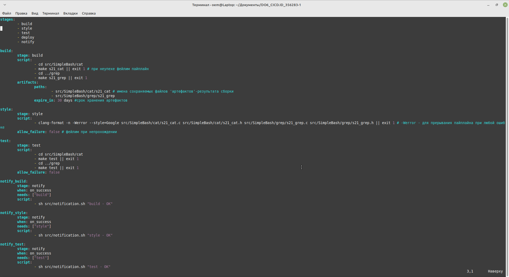  
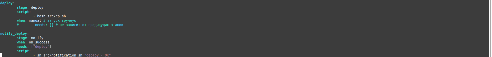  
  
Пайплайн проходит успешно:  
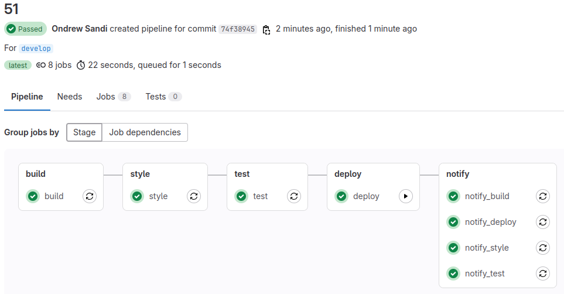  
  
Сообщения отправляются:  
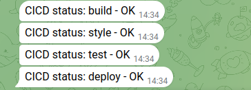  
  
Эмулируем ошибку выполнения пайплайна:  
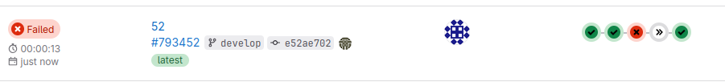  
  
Пайплайн фейлится:  
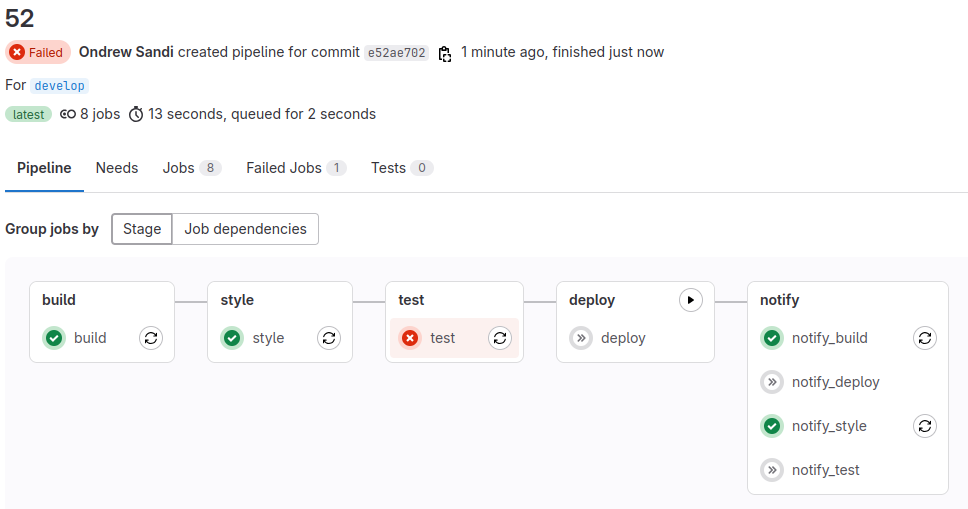  
  
После проверки функциональности тестирования возвращаем работоспособность в исходное состояние.  
